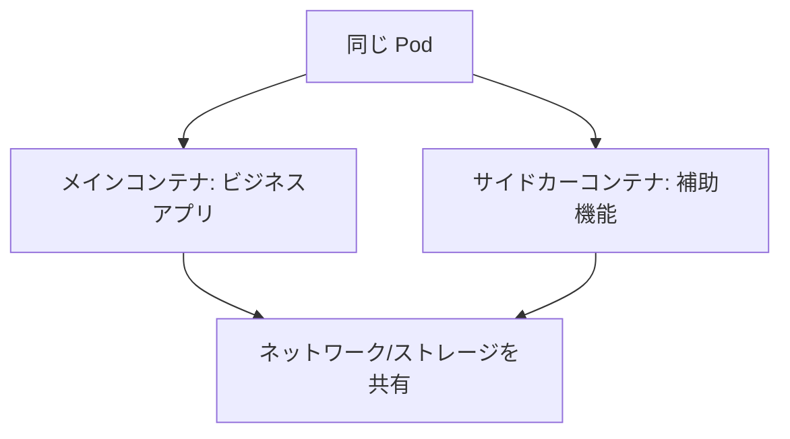

# Pod の構築：サイドカーコンテナを使う

一言で言うと：サイドカーコンテナは同じ Pod でメインコンテナと共有し、ログ収集やプロキシといった補助的な作業を専門に担当する。

## 要点

* サイドカーはメインコンテナと同じ Pod で実行される
* 両者はネットワーク名前空間と、任意でストレージボリュームを共有する
* よくある用途：ログ収集、監視エージェント、設定同期
* Kubernetes はサイドカーを特別なタイプの Init コンテナとして宣言することをサポートする
* メインコンテナはビジネスロジックに専念し、補助機能はサイドカーに任せる
