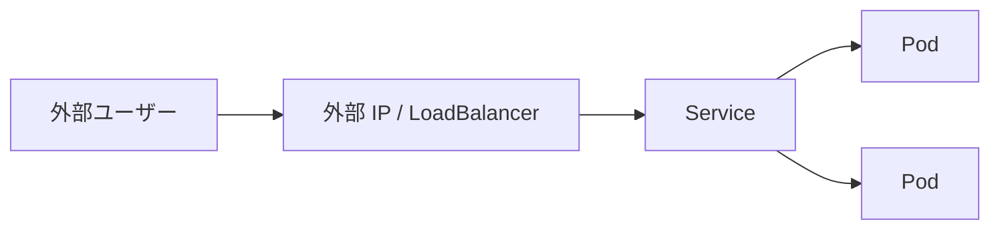

# ステートレスアプリ：外部 IP アドレスを公開する

一言で言うと：ステートレスアプリはローカルデータを保持しないため、自由に再作成・スケールでき、重要なのは外部ユーザーがどうアクセスできるようにするかである。

## 要点

* ステートレスアプリはローカルディスク上の永続データに依存しない
* デフォルトの Service はクラスタ内部からのみアクセス可能
* LoadBalancer や NodePort タイプの Service は外部 IP を公開できる
* クラウド環境では通常自動的に外部ロードバランサーが割り当てられる
* ローカル環境（Minikube など）では追加コマンドでアクセス可能なアドレスを取得する必要がある
