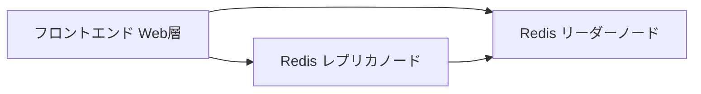

# 実践：Redis を使ってゲストブックアプリをデプロイする

一言で言うと：この定番のケースは Deployment、Service、多層アーキテクチャを統合し、完全なステートレスWebアプリを示す。

## 要点

* フロントエンドはメッセージの受け取りと Redis への読み書きを担当する
* Redis はリーダー1つ・レプリカ複数の構成を採用する
* フロントエンド、リーダーノード、レプリカノードはそれぞれ独立した Deployment で管理される
* 各層には対応する Service があり、相互アクセスを容易にする
* このケースは複数コンポーネントアプリの典型的なトポロジーを示している
