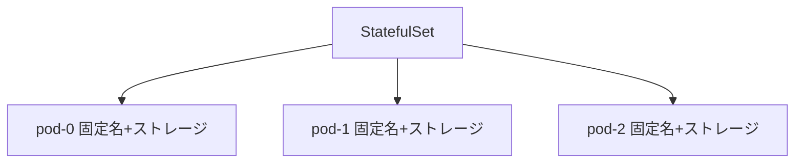

# ステートフルアプリの基礎：StatefulSet

一言で言うと：StatefulSet は安定したアイデンティティと永続データを必要とするアプリ、例えばデータベースクラスタを専門に管理する。

## 要点

* StatefulSet 内の Pod は固定された順序ある名前を持つ
* 各 Pod は独自の永続ボリュームに紐づき、再作成後もデータは失われない
* Pod の作成と削除は順序通りに行われ、並行ではない
* データベースやメッセージキューなどステートフルなシステムでよく使われる
* ヘッドレスサービスと組み合わせて使う必要がある
