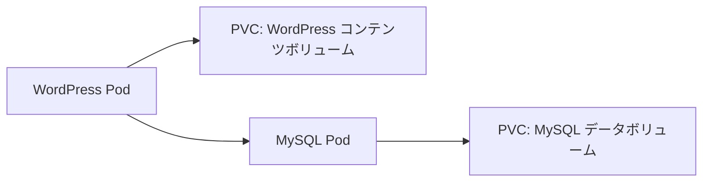

# 実践：永続ボリュームで WordPress と MySQL をデプロイする

一言で言うと：このケースはデータベースとサイトコンテンツが Pod 再作成後も存在し続けるよう、永続ボリュームを使う方法を示す。

## 要点

* MySQL と WordPress はそれぞれ独立した PersistentVolumeClaim を使う
* データベースパスワードは Secret を通じて渡され、平文設定には書かない
* WordPress は環境変数を通じて MySQL の接続アドレスを知る
* 両者とも Deployment（単一レプリカ）と永続ボリュームの組み合わせで管理される
* Pod が再作成されても、コンテンツとデータベースのデータは失われない
