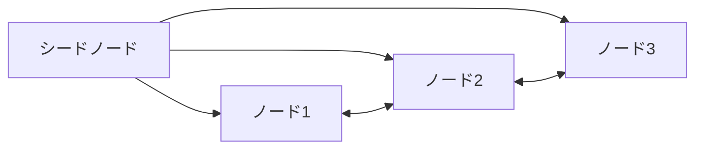

# 実践：StatefulSet で Cassandra をデプロイする

一言で言うと：Cassandra は生まれつき分散データベースであり、このケースは StatefulSet が本物のクラスタをどう管理するかを示す。

## 要点

* Cassandra ノード同士はシードノードを通じてお互いを発見する
* 各ノードは StatefulSet を通じて固定名と独立したストレージを持つ
* ヘッドレスサービスによりノード間の直接通信が可能になる
* スケールアップは StatefulSet のレプリカ数を増やすだけでよい
* 新しく参加したノードは自動的に既存クラスタとデータを同期する
