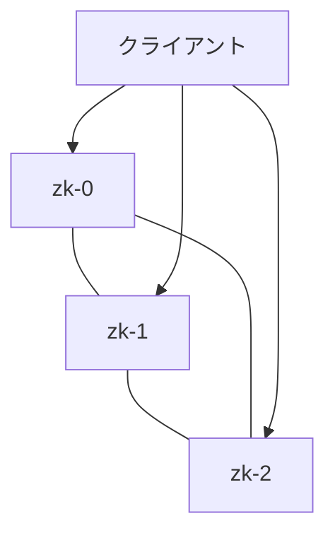

# 実践：分散協調システム ZooKeeper を実行する

一言で言うと：ZooKeeper は厳格な過半数メカニズムに依存して整合性を保証しており、このケースは Kubernetes 上で安全にそれを実行する方法を示す。

## 要点

* ZooKeeper は通常奇数個のノードでクラスタを構成する（例えば 3 や 5）
* StatefulSet がノードの固定された順序ある名前を保証する
* PodDisruptionBudget を使い同時に多くのノードが排出されるのを防ぐ
* アンチアフィニティルールでノードが異なる物理マシンに分散されるようにする
* 目的はメンテナンスや障害時でも過半数の可用性を維持すること
