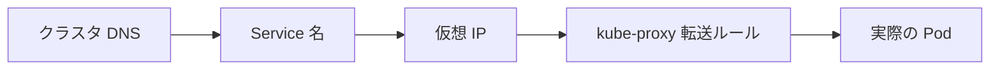

# Service を深掘り：Service でアプリに接続する

一言で言うと：この章は Service の仕組みを掘り下げる——安定した名前が実際のトラフィックにどう変わるのか。

## 要点

* クラスタ内部では Service 名で直接 DNS 解決できる
* Service は安定した仮想 IP（ClusterIP）を持つ
* kube-proxy は各ノードでトラフィック転送ルールを維持する
* Endpoints/EndpointSlice は現在健全な Pod のリストを記録する
* この仕組みによりアプリ間の接続は Pod のライフサイクルを一切気にしなくてよい
