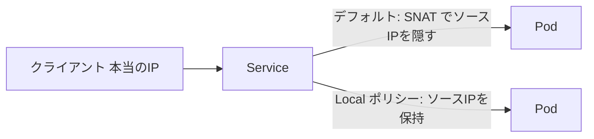

# Service を深掘り：ソース IP とトラフィック保持を使う

一言で言うと：デフォルトでは Service はクライアントの本当の IP を隠してしまい、一部のシナリオではそれを保持するために専用の設定が必要になる。

## 要点

* デフォルトの転送ポリシーはクライアントの本当のIPをノードIPで置き換える場合がある
* アクセス制御や統計を行うアプリには本当のソースIPが必要なことが多い
* `externalTrafficPolicy: Local` でクライアントのソースIPを保持できる
* Local ポリシーを使う代償として、トラフィック分散がノードをまたいで均等でなくなる
* ビジネスがソースIPを気にするかどうかでこの設定を判断する必要がある
