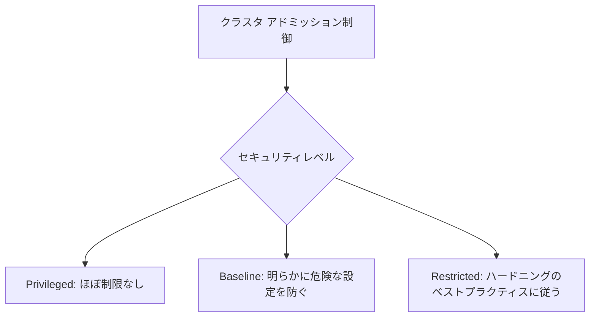

# セキュリティ：クラスタレベルで Pod セキュリティ標準を適用する

一言で言うと：Pod セキュリティ標準はいくつかのセキュリティ基準を定義しており、クラスタレベルの設定によりすべての名前空間がデフォルトで同じルールに従うようになる。

## 要点

* Pod セキュリティ標準は Privileged、Baseline、Restricted の3段階に分かれる
* クラスタレベルの設定はすべての名前空間のデフォルトポリシーとなる
* アドミッションコントローラを通じて Pod 作成時に自動的に検証される
* 標準に適合しない Pod は作成が拒否されるか、警告のみが記録される
* クラスタ全体に統一されたセキュリティの底線を設定するのに適している
