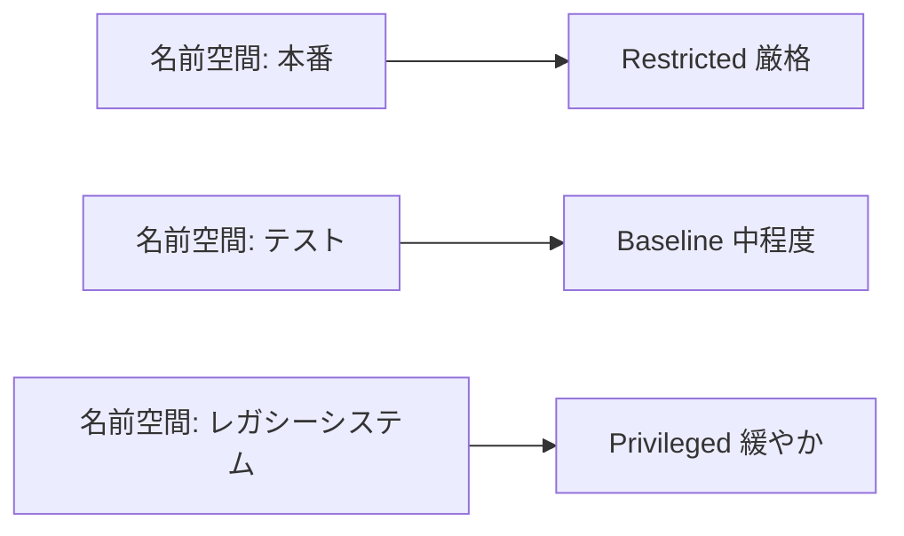

# セキュリティ：名前空間レベルで Pod セキュリティ標準を適用する

一言で言うと：チームや事業によってセキュリティ要件は異なるため、名前空間レベルの設定でよりきめ細かい差別化管理ができる。

## 要点

* 名前空間にラベルを付けることでセキュリティレベルを設定する
* 異なる名前空間で異なる段階のセキュリティ標準を使える
* よくあるやり方：本番は Restricted、テストは Baseline
* レガシーシステムが一時的に厳格な標準を満たせない場合は一時的に緩和できる
* 名前空間レベルの設定はクラスタレベルのデフォルト値を上書きする
