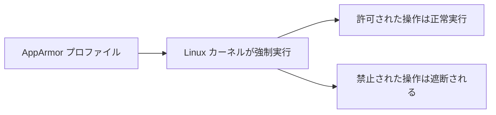

# セキュリティ：AppArmor でコンテナのリソースアクセスを制限する

一言で言うと：AppArmor は Linux カーネルが提供する強制アクセス制御機構で、コンテナに明示的に許可されたことしかできないよう制限できる。

## 要点

* AppArmor はプロファイルでコンテナに許可される行動の境界を定義する
* 制限範囲にはファイルアクセス、ネットワーク権限、システムコールなどが含まれる
* あらかじめノードのOSに対応するプロファイルをロードしておく必要がある
* Pod 定義でアノテーションやフィールドを通じて使用するプロファイルを参照する
* コンテナ内のプロセスが乗っ取られても、プロファイルが設定した境界を突破するのは難しい
