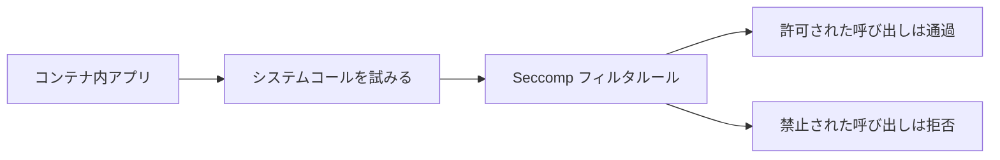

# セキュリティ：Seccomp でコンテナのシステムコールを制限する

一言で言うと：Seccomp はシステムコールのレベルで直接制限をかけ、コンテナが乗っ取られた際の被害範囲をさらに縮小する。

## 要点

* Seccomp はコンテナプロセスが使用できるシステムコールを制限する
* ほとんどのアプリは実際にはごく一部のシステムコールしか必要としない
* Kubernetes は組み込みの RuntimeDefault プロファイルを合理的な出発点として提供する
* より細かいホワイトリスト制御のためにカスタムプロファイルを書くこともできる
* AppArmor と組み合わせることで多層防御を形成できる
