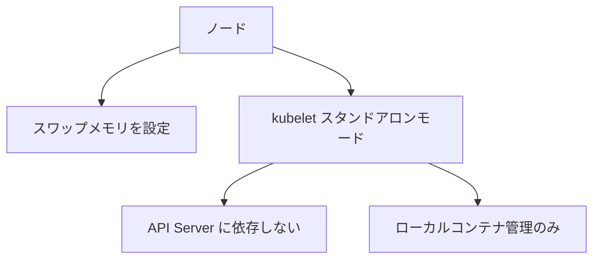

# クラスタ管理：スワップメモリとスタンドアロンモードの kubelet

一言で言うと：この章は比較的低レベルなクラスタ管理の話題を二つ扱う——ノード上のスワップメモリ設定と、kubelet をコントロールプレーンから切り離して単独で動かす方法。

## 要点

* スワップメモリはメモリが逼迫した際に追加のバッファを提供できる
* スワップメモリを有効にする際はパフォーマンスとスケジューリングへの影響を慎重に評価する必要がある
* スタンドアロンモードの kubelet はコントロールプレーンに接続せず、API Server を必要としない
* スタンドアロンモードはエッジデバイスや特殊なローカルコンテナ管理シナリオでよく使われる
* どちらも比較的高度なノードレベルの設定に属する
