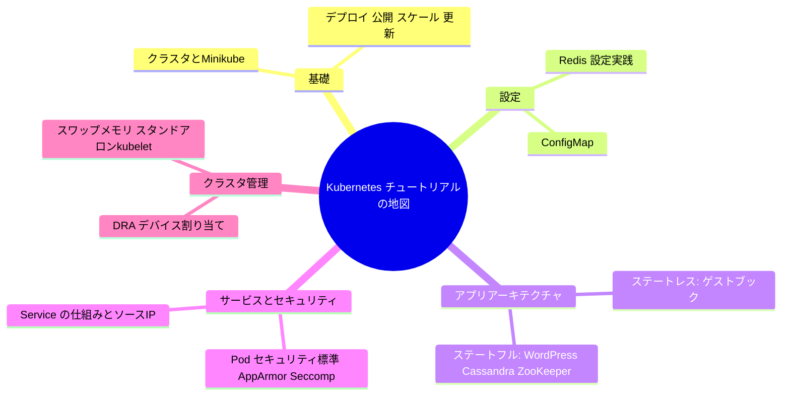

# まとめと今後の学習パスの提案

一言で言うと：概念から実践まで、このコースは Kubernetes 公式チュートリアルの完全な地図を歩き終えた。この先どこへ向かうかはあなたのシナリオ次第だ。

## 要点

* 基礎編はクラスタの作り方とアプリの動かし方を教える
* 設定編は設定をイメージから分離する方法を教える
* ステートレス・ステートフルアプリ編は実際のケースでアーキテクチャ思考を固める
* サービスとセキュリティ編はトラフィックがどう安全にルーティングされるかを理解させる
* クラスタ管理編はより低レベルで高度な運用の話題を扱う
* よくある誤解：ステートレスなやり方をそのままデータベースのようなステートフルシステムに適用してしまうこと
* 次のステップ：可観測性、ネットワークポリシー、スケジューリングフレームワークなど、特定の方向を深掘りできる
