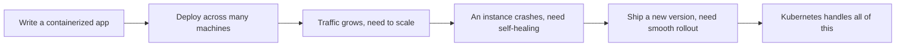

# Why Learn Kubernetes

In short: as applications grow more numerous and complex, managing containers by hand quickly becomes unmanageable. Kubernetes exists to automate that.

## Key Points

* Kubernetes is a container orchestration system
* It handles deployment, scaling, self-healing, and updates
* This course follows the structure of the official Kubernetes tutorials
* Learning order: basics -> configuration -> stateless apps -> stateful apps -> services -> security -> cluster management
* Each chapter maps to a real scenario from the official tutorials
