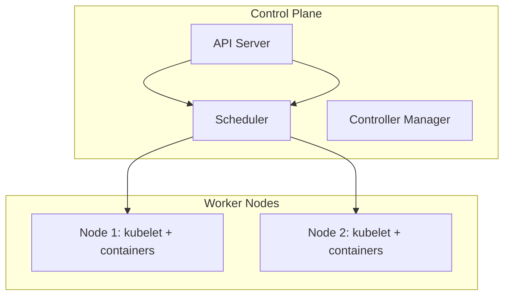

# Kubernetes Basics: Clusters and Core Concepts

In short: a Kubernetes cluster is made of a control plane and worker nodes — the control plane makes decisions, and the nodes actually run the containers.

## Key Points

* A cluster = a control plane + a set of worker nodes
* The API Server is the single entry point for all operations
* The scheduler decides which node a Pod should run on
* kubelet is the node-level agent that actually manages containers
* Learning environments commonly use Minikube to simulate a full cluster locally
