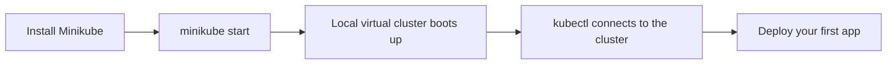

# Hello Minikube: Creating Your First Cluster

In short: Minikube lets you spin up a real, usable Kubernetes cluster on your own machine with a single command.

## Key Points

* `minikube start` boots a local cluster with one command
* Minikube automatically configures kubectl's connection
* `kubectl cluster-info` confirms the cluster is ready
* `minikube dashboard` opens a visual dashboard
* This is the common starting point for all the tutorials that follow
