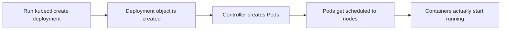

# Deploying an App: Creating a Deployment with kubectl

In short: a Deployment describes "what I want to run and how many copies," and kubectl turns that wish into reality.

## Key Points

* A Deployment describes the desired state of an application
* `kubectl create deployment` is the quickest way to create one
* The Deployment controller continuously keeps the actual state matching the desired state
* One Deployment usually corresponds to one application component
* `kubectl get deployments` lists all current Deployments
