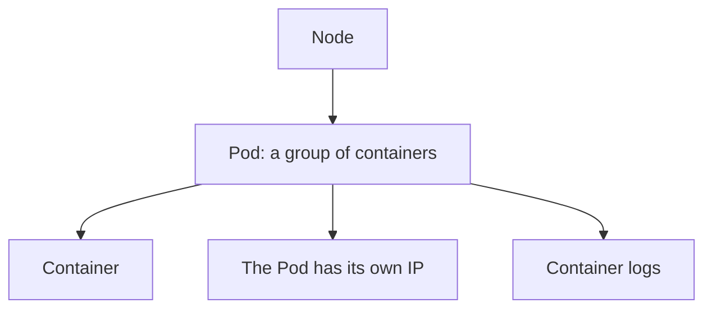

# Exploring Your App: Viewing Pods and Nodes

In short: a Pod is the smallest deployable unit in Kubernetes, and understanding its state is the first step in troubleshooting anything.

## Key Points

* A Pod is a collection of one or more containers sharing network and storage
* `kubectl get pods` shows all current Pods and their status
* `kubectl describe pod` shows detailed events for a specific Pod
* `kubectl logs` shows the logs a container has printed
* Each Pod has its own IP address inside the cluster
