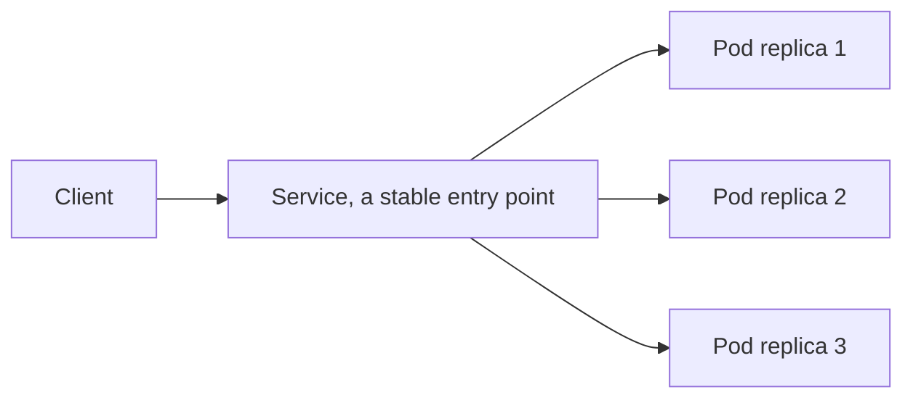

# Exposing an App: Using a Service

In short: Pods get recreated and their IPs change, so a Service provides a stable entry point so others can always find your application.

## Key Points

* A Pod's IP is unstable and changes after it's recreated
* A Service provides a fixed, stable access point
* A Service finds its Pods using a label selector
* `kubectl expose deployment` quickly creates a Service
* A Service automatically distributes traffic across multiple Pods
