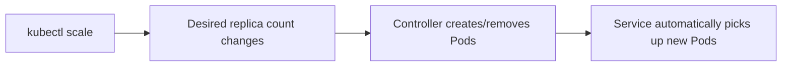

# Scaling Your App: Running Multiple Instances

In short: when traffic grows, you just tell Kubernetes how many replicas you want, and scheduling and load distribution are handled automatically.

## Key Points

* Scaling is essentially just changing a Deployment's desired replica count
* `kubectl scale deployment --replicas=N` is the most direct way to do it
* When scaling up, new Pods are automatically picked up by the existing Service
* When scaling down, extra Pods are terminated safely
* Scaling requires no changes to application code
