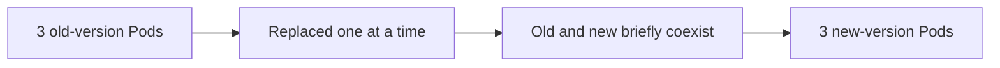

# Updating Your App: Performing a Rolling Update

In short: a rolling update gradually replaces old-version Pods with new ones, keeping the service available the whole time.

## Key Points

* `kubectl set image` triggers a rolling update
* During the update, old and new version Pods briefly coexist
* The service stays available throughout — it never all goes down at once
* `kubectl rollout status` shows update progress
* `kubectl rollout undo` can roll back to the previous version
