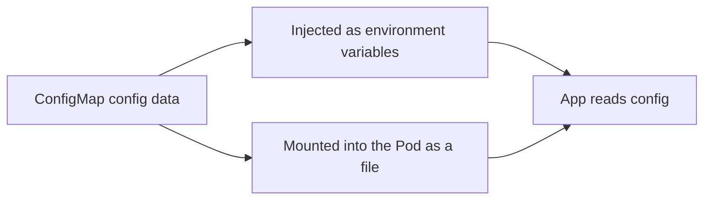

# Configuration: Managing Config with ConfigMaps

In short: a ConfigMap separates configuration data from the container image, letting the same image adapt to different environments.

## Key Points

* A ConfigMap holds non-sensitive configuration data
* Separating config from image lets one image serve multiple environments
* Config can be injected as environment variables into a Pod
* Config can also be mounted as a file at a path inside the container
* By default, changing a ConfigMap requires restarting the Pod for it to take effect
