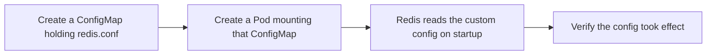

# Hands-On: Configuring Redis Using a ConfigMap

In short: this tutorial applies ConfigMaps to a real-world scenario, showing how to customize Redis's runtime parameters.

## Key Points

* First create a ConfigMap containing the content of redis.conf
* In the Pod spec, mount the ConfigMap as a volume
* At startup, tell the Redis container to use the config file at the mounted path
* Use redis-cli to verify whether the configuration parameters took effect
* This is the complete loop from ConfigMap concept to real practice
