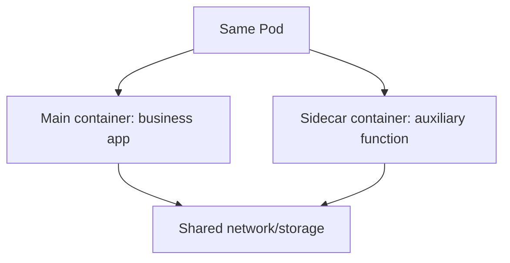

# Authoring Pods: Using Sidecar Containers

In short: a sidecar container shares the same Pod as the main container and handles auxiliary work like log collection or proxying.

## Key Points

* A sidecar runs in the same Pod as the main container
* They share the network namespace and, optionally, storage volumes
* Common uses: log collection, monitoring agents, config syncing
* Kubernetes supports declaring a sidecar as a special type of init container
* The main container focuses purely on business logic while the sidecar handles auxiliary work
