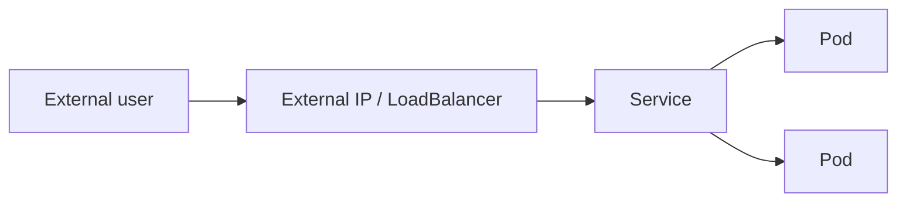

# Stateless Applications: Exposing an External IP Address

In short: a stateless app doesn't hold onto local data, so it can be freely recreated and scaled — what matters most is how external users can reach it.

## Key Points

* A stateless app doesn't depend on data persisted on local disk
* A default Service is only reachable from inside the cluster
* A Service of type LoadBalancer or NodePort can expose an external IP
* Cloud environments typically auto-provision an external load balancer
* Local environments (like Minikube) need an extra command to get a reachable address
