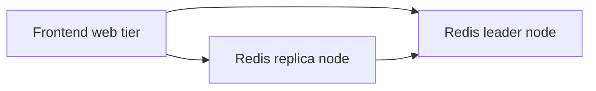

# Hands-On: Deploying a Guestbook App with Redis

In short: this classic example combines Deployments, Services, and a multi-tier architecture into one complete stateless web application.

## Key Points

* The frontend accepts guestbook entries and reads/writes Redis
* Redis uses a single-leader, multi-replica structure
* Frontend, leader, and replica nodes are each managed by their own Deployment
* Each tier has a corresponding Service to make cross-tier access easy
* This case demonstrates a typical topology for a multi-component application
