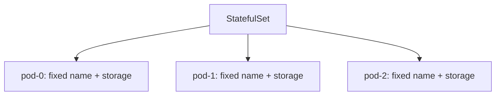

# Stateful Application Basics: StatefulSet

In short: a StatefulSet is specifically for managing applications that need a stable identity and persistent data — like database clusters.

## Key Points

* Pods in a StatefulSet get fixed, ordered names
* Each Pod binds to its own dedicated persistent volume, so data survives recreation
* Pods are created and deleted in order, not concurrently
* Commonly used for databases, message queues, and other stateful systems
* Needs to be paired with a headless Service
