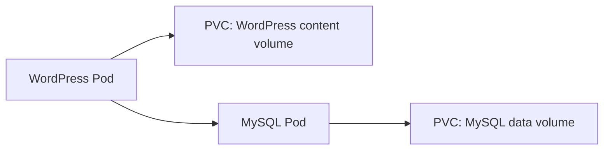

# Hands-On: Deploying WordPress and MySQL with Persistent Volumes

In short: this case shows how to use persistent volumes so that a database and site content both survive Pod recreation.

## Key Points

* MySQL and WordPress each use their own independent PersistentVolumeClaim
* The database password is passed via a Secret, not written in plain-text config
* WordPress learns MySQL's connection address through environment variables
* Both use a Deployment (single replica) paired with a persistent volume
* Content and database data both survive Pod recreation
