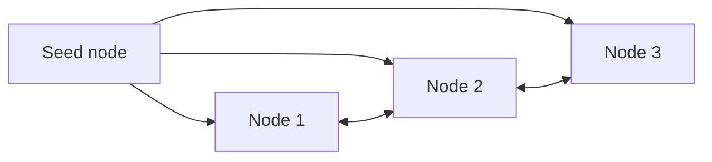

# Hands-On: Deploying Cassandra with a StatefulSet

In short: Cassandra is a naturally distributed database, and this case shows how a StatefulSet manages a real cluster of it.

## Key Points

* Cassandra nodes discover each other through a seed node
* Each node gets a fixed name and independent storage via the StatefulSet
* A headless Service lets nodes communicate directly with each other
* Scaling up just means increasing the StatefulSet's replica count
* Newly joined nodes automatically sync data with the existing cluster
