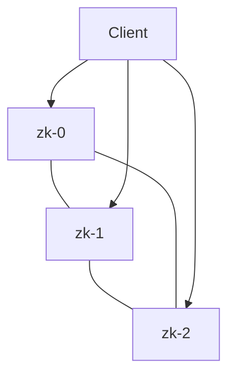

# Hands-On: Running ZooKeeper, a Distributed Coordination System

In short: ZooKeeper relies on a strict majority mechanism to guarantee consistency, and this case shows how to run it safely on Kubernetes.

## Key Points

* ZooKeeper usually forms a cluster with an odd number of nodes (e.g., 3 or 5)
* A StatefulSet guarantees nodes get fixed, ordered names
* A PodDisruptionBudget prevents too many nodes from being evicted at once
* Anti-affinity rules keep nodes spread across different physical machines
* The goal is to preserve a majority even during maintenance or failures
