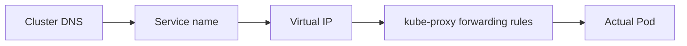

# Services in Depth: Connecting Applications with Services

In short: this chapter digs into how a Service actually works — how a stable name turns into real traffic.

## Key Points

* Inside the cluster, a Service name can be resolved directly via DNS
* A Service has a stable virtual IP (ClusterIP)
* kube-proxy maintains forwarding rules on every node
* Endpoints/EndpointSlice track the list of currently healthy Pods
* This mechanism lets applications connect to each other without caring about a Pod's lifecycle at all
