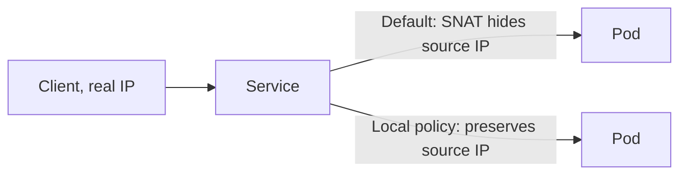

# Services in Depth: Using Source IP and Traffic Preservation

In short: by default, a Service hides the client's real IP, and some scenarios need special configuration to preserve it.

## Key Points

* The default forwarding policy may replace the client's real IP with a node IP
* Applications doing access control or analytics often need the real source IP
* `externalTrafficPolicy: Local` can preserve the client's source IP
* The tradeoff for using Local is that traffic distribution is no longer balanced across nodes
* Whether to use this setting depends on whether the business actually cares about source IP
