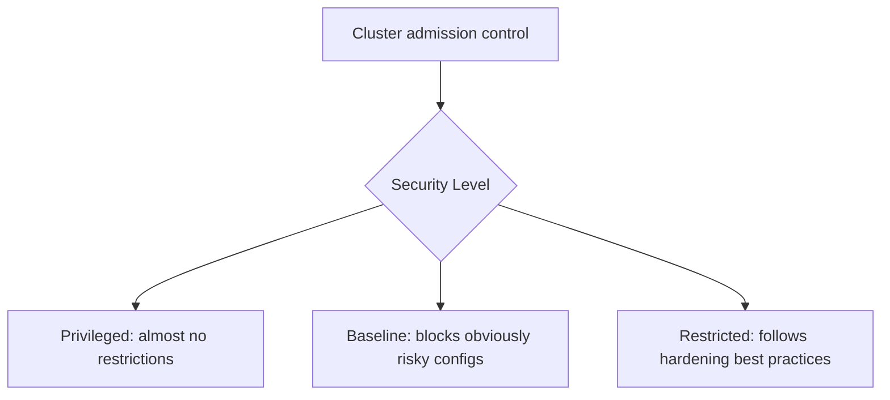

# Security: Applying Pod Security Standards at the Cluster Level

In short: Pod Security Standards define a few security baselines, and configuring them at the cluster level makes every namespace follow the same rules by default.

## Key Points

* Pod Security Standards come in three tiers: Privileged, Baseline, Restricted
* Cluster-level configuration serves as the default policy for every namespace
* Enforcement happens automatically at Pod creation time via an admission controller
* Non-compliant Pods can be rejected outright, or just logged as a warning
* Well suited for setting a single, unified security baseline across the whole cluster
