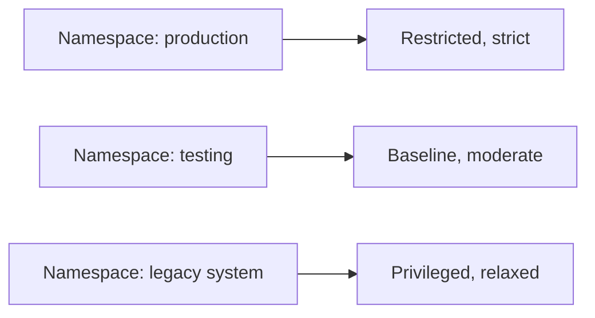

# Security: Applying Pod Security Standards at the Namespace Level

In short: different teams and workloads have different security needs, and namespace-level configuration allows for more fine-grained, differentiated management.

## Key Points

* Security level is set by applying labels to a namespace
* Different namespaces can use different tiers of the security standard
* A common pattern: Restricted for production, Baseline for testing
* Legacy systems that can't yet meet strict standards can be temporarily relaxed
* Namespace-level settings override the cluster-level default
