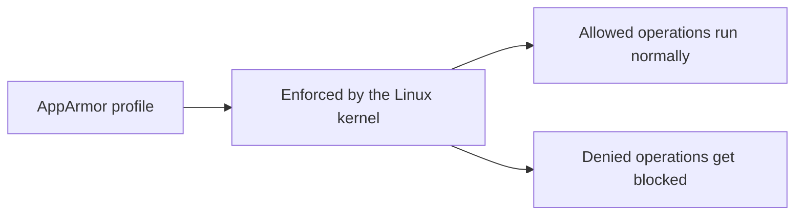

# Security: Restricting a Container's Access to Resources with AppArmor

In short: AppArmor is a mandatory access control mechanism built into the Linux kernel that can restrict a container to only doing what it's explicitly allowed to do.

## Key Points

* AppArmor uses profiles to define the boundaries of what a container is allowed to do
* Restrictions cover things like file access, network capabilities, and system calls
* The corresponding profile must first be loaded on the node's host OS
* Pod definitions reference which profile to use via annotations or fields
* Even if a process inside the container is compromised, it's hard to break past the boundary set by the profile
