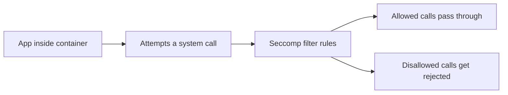

# Security: Restricting a Container's System Calls with Seccomp

In short: Seccomp restricts things right at the system call level, further shrinking the blast radius if a container ever gets compromised.

## Key Points

* Seccomp restricts which system calls a container process can make
* Most applications only actually need a small subset of system calls
* Kubernetes provides a built-in RuntimeDefault profile as a reasonable starting point
* Custom profiles can also be written for finer-grained allowlist control
* Combined with AppArmor, it forms a layered defense
