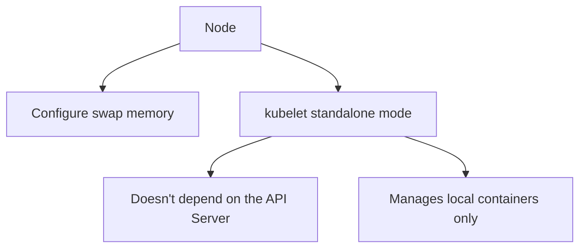

# Cluster Management: Swap Memory and Standalone kubelet

In short: this chapter covers two fairly low-level cluster management topics — configuring swap memory on a node, and running kubelet standalone, detached from the control plane.

## Key Points

* Swap memory can provide extra buffer when memory is under pressure
* Enabling swap requires carefully evaluating its impact on performance and scheduling
* In standalone mode, kubelet doesn't connect to the control plane and doesn't need an API Server
* Standalone mode is commonly used for edge devices or specialized local container management scenarios
* Both are fairly advanced, node-level configuration topics
