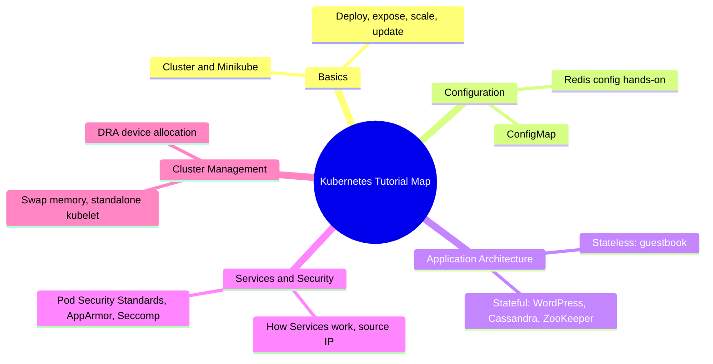

# Summary and Suggested Learning Path

In short: from concepts to hands-on practice, this course has walked the full map of the official Kubernetes tutorials — where you go next depends on your own scenario.

## Key Points

* The basics section teaches you how to create a cluster and get apps running
* The configuration section teaches you to decouple config from images
* The stateless and stateful application sections reinforce architectural thinking with real cases
* The services and security section helps you understand how traffic is routed safely
* The cluster management section covers lower-level, more advanced operational topics
* A common pitfall: applying stateless practices directly to stateful systems like databases
* Next steps: you can go deeper in a specific direction, such as observability, network policies, or the scheduling framework
