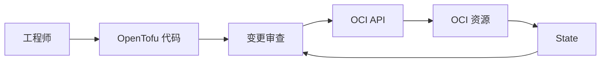

# 课程导览与实验室边界

这个实验室能学到什么，又刻意不做什么？

## 核心要点

* 本课程基于 opentofu-oci-learning-lab 项目，用可运行的小规模 IaC 学习 OpenTofu 与 OCI
* 这不是生产模板，默认配置也会创建真实 OCI 资源，执行前必须 `tofu plan` 并确认最新价格
* 课程边界：不涉及完整高可用、企业级 IAM、灾备；证书与 Resource Manager 只做概念讲解

---

## 本章测验

本章共 5 道单项选择题。

### 第 1 题

这个实验室项目的主要定位是什么？

- A. 一个用可运行的小规模 IaC 系统学习 OpenTofu 与 OCI 的教学项目
- B. 一套可以直接用于生产环境的部署模板
- C. 一个只做静态语法检查、不创建真实资源的沙盒
- D. 一个专门用于灾备演练的高可用架构

选择答案后查看结果

正确答案：A

答案解析：项目 README 明确说明这是学习用途的小规模 IaC，不是生产模板，且默认配置就会创建真实资源。

### 第 2 题

为什么说“即使是默认配置也需要谨慎”？

- A. 因为默认配置会自动开启所有高危资源如数据库和负载均衡
- B. 因为默认配置已经会创建真实的 OCI 资源，可能产生费用
- C. 因为默认配置在语法上就是错误的
- D. 因为默认配置只在特定地区可用

选择答案后查看结果

正确答案：B

答案解析：README 强调默认配置也会创建 Compartment、VCN 等真实资源，虽然大多数默认资源风险较低，但仍应在执行前用 plan 确认。

### 第 3 题

以下哪一项不属于本课程的学习目标？

- A. 解释 .tf、Provider、Resource、State 之间的关系
- B. 读懂 plan 中的 +、~、-/+、- 符号
- C. 为不同客户设计多租户企业级 IAM 权限体系
- D. 安全地管理密钥、密码、OCID，不将其写入 Git

选择答案后查看结果

正确答案：C

答案解析：README 列出的学习目标聚焦在 IaC 基础概念与 OCI 资源生命周期，企业级 IAM 设计明确不在范围内。

### 第 4 题

Certificates 与 Resource Manager 在本课程中是如何处理的？

- A. 完全跳过，不在任何文档中提及
- B. 作为默认启用资源直接创建
- C. 只能通过手动 Console 操作，代码中完全不涉及
- D. 只做概念和扩展步骤的文档讲解，不生成真实资源

选择答案后查看结果

正确答案：D

答案解析：为了避免私钥意外写入 State，以及 Resource Manager 与本地 OpenTofu 执行基础不同，这两项被限定为概念讲解。

### 第 5 题

下列哪种理解最符合本课程对“成功”的定义？

- A. 完成 fmt、validate、经过审查的 plan、选择性 apply、确认结果，并最终 destroy
- B. 只要 tofu validate 通过就算完成学习
- C. 只要 apply 成功且不再执行 destroy 就算完成
- D. 只要复制代码到生产环境运行就算完成

选择答案后查看结果

正确答案：A

答案解析：文档说明成功条件包含格式化、初始化、验证、审查过的 plan、选定资源的 apply、确认，以及最后的 destroy，形成完整闭环。

<!-- QUIZ_DATA_START
{
  "chapter": "01",
  "questions": [
    {
      "id": 1,
      "question": "这个实验室项目的主要定位是什么？",
      "options": {
        "A": "一个用可运行的小规模 IaC 系统学习 OpenTofu 与 OCI 的教学项目",
        "B": "一套可以直接用于生产环境的部署模板",
        "C": "一个只做静态语法检查、不创建真实资源的沙盒",
        "D": "一个专门用于灾备演练的高可用架构"
      },
      "answer": "A",
      "explanation": "项目 README 明确说明这是学习用途的小规模 IaC，不是生产模板，且默认配置就会创建真实资源。"
    },
    {
      "id": 2,
      "question": "为什么说“即使是默认配置也需要谨慎”？",
      "options": {
        "A": "因为默认配置会自动开启所有高危资源如数据库和负载均衡",
        "B": "因为默认配置已经会创建真实的 OCI 资源，可能产生费用",
        "C": "因为默认配置在语法上就是错误的",
        "D": "因为默认配置只在特定地区可用"
      },
      "answer": "B",
      "explanation": "README 强调默认配置也会创建 Compartment、VCN 等真实资源，虽然大多数默认资源风险较低，但仍应在执行前用 plan 确认。"
    },
    {
      "id": 3,
      "question": "以下哪一项不属于本课程的学习目标？",
      "options": {
        "A": "解释 .tf、Provider、Resource、State 之间的关系",
        "B": "读懂 plan 中的 +、~、-/+、- 符号",
        "C": "为不同客户设计多租户企业级 IAM 权限体系",
        "D": "安全地管理密钥、密码、OCID，不将其写入 Git"
      },
      "answer": "C",
      "explanation": "README 列出的学习目标聚焦在 IaC 基础概念与 OCI 资源生命周期，企业级 IAM 设计明确不在范围内。"
    },
    {
      "id": 4,
      "question": "Certificates 与 Resource Manager 在本课程中是如何处理的？",
      "options": {
        "A": "完全跳过，不在任何文档中提及",
        "B": "作为默认启用资源直接创建",
        "C": "只能通过手动 Console 操作，代码中完全不涉及",
        "D": "只做概念和扩展步骤的文档讲解，不生成真实资源"
      },
      "answer": "D",
      "explanation": "为了避免私钥意外写入 State，以及 Resource Manager 与本地 OpenTofu 执行基础不同，这两项被限定为概念讲解。"
    },
    {
      "id": 5,
      "question": "下列哪种理解最符合本课程对“成功”的定义？",
      "options": {
        "A": "完成 fmt、validate、经过审查的 plan、选择性 apply、确认结果，并最终 destroy",
        "B": "只要 tofu validate 通过就算完成学习",
        "C": "只要 apply 成功且不再执行 destroy 就算完成",
        "D": "只要复制代码到生产环境运行就算完成"
      },
      "answer": "A",
      "explanation": "文档说明成功条件包含格式化、初始化、验证、审查过的 plan、选定资源的 apply、确认，以及最后的 destroy，形成完整闭环。"
    }
  ]
}
QUIZ_DATA_END -->
