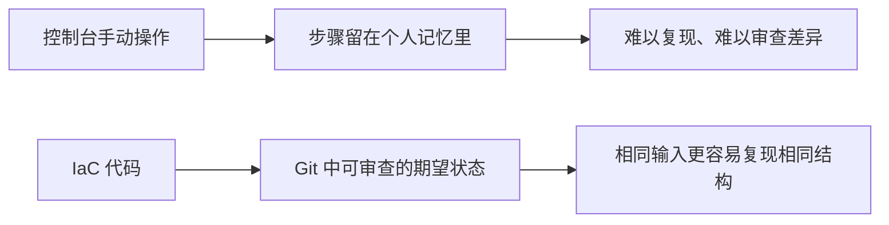

# IaC 要解决的问题

为什么要用代码而不是在控制台里点鼠标来管理基础设施？

## 核心要点

* 控制台手动操作的步骤留在人的记忆里，既难以复现，也难以做差异审查
* IaC 把“期望状态”写成代码，放进 Git 里做变更审查，让相同输入更容易得到相同的结构
* 但并不能保证“每次结果完全相同”——凭证、配额、区域容量、Provider 版本、外部改动都会带来变数

---

## 本章测验

本章共 5 道单项选择题。

### 第 1 题

手动在控制台里创建资源，最主要的问题是什么？

- A. 控制台的响应速度比命令行慢
- B. 操作步骤留在人的记忆中，难以复现和审查
- C. 控制台无法创建 Compute 实例
- D. 控制台只支持免费资源

选择答案后查看结果

正确答案：B

答案解析：文档指出手动操作的核心痛点是步骤留存在个人记忆里，既难以复现也难以做差异审查，这正是 IaC 想解决的问题。

### 第 2 题

IaC 相比手动操作带来的主要好处是什么？

- A. 彻底消除所有云资源产生的费用
- B. 自动获得企业级的高可用架构
- C. 期望状态可以用 Git 做代码审查，相同输入更容易复现相同结构
- D. 自动生成完整的灾备方案

选择答案后查看结果

正确答案：C

答案解析：IaC 的核心价值在于把配置变成可审查、可版本化的代码，相同输入更容易得到一致的结果，而不是消除费用或自动获得高可用。

### 第 3 题

为什么说 IaC 不能保证“每次结果完全相同”？

- A. 因为 IaC 代码本身语法不稳定
- B. 因为 OpenTofu 每次运行都会随机生成资源名称
- C. 因为 OCI 不支持任何形式的自动化
- D. 因为凭证、配额、区域容量、Provider 版本、外部改动等因素都会带来变数

选择答案后查看结果

正确答案：D

答案解析：文档明确指出，即使代码相同，账户配额、区域容量、Provider 版本差异、控制台里的手动改动都可能导致结果不完全一致。

### 第 4 题

在“Engineer → Code → Plan → API → Resource → State → Plan”这张图中，State 的作用体现在哪里？

- A. State 会反馈进入下一次的 Plan 计算，用于对比期望与现状
- B. State 是发送给 OCI API 的原始请求内容
- C. State 是工程师手写的初始需求文档
- D. State 只在第一次创建资源时使用一次，之后不再起作用

选择答案后查看结果

正确答案：A

答案解析：图中 State 指向 Plan，说明每一次新的 plan 都会读取 State 来计算差异，而不是只用一次就作废。

### 第 5 题

以下哪种说法最准确地描述了 IaC 在本课程中的定位？

- A. 只要写了 IaC 代码，就完全不需要关注云服务商的定价变化
- B. IaC 让基础设施变更变得可审查、可复现，但不是万能的确定性保证
- C. IaC 可以完全替代人工检查资源是否创建成功
- D. 只要使用 IaC，就不会再出现任何权限或配额错误

选择答案后查看结果

正确答案：B

答案解析：文档强调 IaC 解决的是可复现性和可审查性的问题，但配额、权限、容量等仍然可能导致差异，需要工程师持续关注。

<!-- QUIZ_DATA_START
{
  "chapter": "02",
  "questions": [
    {
      "id": 1,
      "question": "手动在控制台里创建资源，最主要的问题是什么？",
      "options": {
        "A": "控制台的响应速度比命令行慢",
        "B": "操作步骤留在人的记忆中，难以复现和审查",
        "C": "控制台无法创建 Compute 实例",
        "D": "控制台只支持免费资源"
      },
      "answer": "B",
      "explanation": "文档指出手动操作的核心痛点是步骤留存在个人记忆里，既难以复现也难以做差异审查，这正是 IaC 想解决的问题。"
    },
    {
      "id": 2,
      "question": "IaC 相比手动操作带来的主要好处是什么？",
      "options": {
        "A": "彻底消除所有云资源产生的费用",
        "B": "自动获得企业级的高可用架构",
        "C": "期望状态可以用 Git 做代码审查，相同输入更容易复现相同结构",
        "D": "自动生成完整的灾备方案"
      },
      "answer": "C",
      "explanation": "IaC 的核心价值在于把配置变成可审查、可版本化的代码，相同输入更容易得到一致的结果，而不是消除费用或自动获得高可用。"
    },
    {
      "id": 3,
      "question": "为什么说 IaC 不能保证“每次结果完全相同”？",
      "options": {
        "A": "因为 IaC 代码本身语法不稳定",
        "B": "因为 OpenTofu 每次运行都会随机生成资源名称",
        "C": "因为 OCI 不支持任何形式的自动化",
        "D": "因为凭证、配额、区域容量、Provider 版本、外部改动等因素都会带来变数"
      },
      "answer": "D",
      "explanation": "文档明确指出，即使代码相同，账户配额、区域容量、Provider 版本差异、控制台里的手动改动都可能导致结果不完全一致。"
    },
    {
      "id": 4,
      "question": "在“Engineer → Code → Plan → API → Resource → State → Plan”这张图中，State 的作用体现在哪里？",
      "options": {
        "A": "State 会反馈进入下一次的 Plan 计算，用于对比期望与现状",
        "B": "State 是发送给 OCI API 的原始请求内容",
        "C": "State 是工程师手写的初始需求文档",
        "D": "State 只在第一次创建资源时使用一次，之后不再起作用"
      },
      "answer": "A",
      "explanation": "图中 State 指向 Plan，说明每一次新的 plan 都会读取 State 来计算差异，而不是只用一次就作废。"
    },
    {
      "id": 5,
      "question": "以下哪种说法最准确地描述了 IaC 在本课程中的定位？",
      "options": {
        "A": "只要写了 IaC 代码，就完全不需要关注云服务商的定价变化",
        "B": "IaC 让基础设施变更变得可审查、可复现，但不是万能的确定性保证",
        "C": "IaC 可以完全替代人工检查资源是否创建成功",
        "D": "只要使用 IaC，就不会再出现任何权限或配额错误"
      },
      "answer": "B",
      "explanation": "文档强调 IaC 解决的是可复现性和可审查性的问题，但配额、权限、容量等仍然可能导致差异，需要工程师持续关注。"
    }
  ]
}
QUIZ_DATA_END -->
