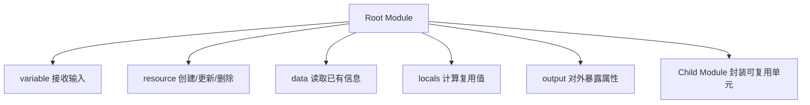

# OpenTofu 核心构成要素

resource、data、variable、module 这些关键字到底各自负责什么？

## 核心要点

* Root Module 是执行目录，负责统筹 Provider、输入和 Child Module 的连接
* resource 负责创建、更新、删除资源；data 只负责读取已存在的信息，不会创建任何东西
* variable 接收外部输入，locals 定义模块内部复用的计算值，output 把重要属性暴露给使用者或其他处理流程

---

## 本章测验

本章共 5 道单项选择题。

### 第 1 题

resource 和 data 这两个关键字最本质的区别是什么？

- A. resource 只能用于网络资源，data 只能用于计算资源
- B. data 的执行速度总是比 resource 快
- C. resource 负责创建、更新、删除资源，data 只负责读取已经存在的信息
- D. resource 和 data 在功能上完全等价，可以互相替换

选择答案后查看结果

正确答案：C

答案解析：文档明确区分：resource 是对资源的创建、更新、删除操作，data 则是查询既有信息，两者语义完全不同。

### 第 2 题

Child Module 存在的主要目的是什么？

- A. 强制要求每个资源都必须单独放进一个模块
- B. 让所有变量都变成全局共享的常量
- C. 取代 Provider 完成与云 API 的通信
- D. 把相关联的资源封装成可以复用的单元

选择答案后查看结果

正确答案：D

答案解析：文档说明 Child Module 用于把关联资源打包成可复用单元，但并不要求所有资源都要拆成独立模块，那样反而会增加追踪难度。

### 第 3 题

locals 和 variable 的关系描述正确的是？

- A. variable 接收外部传入的值，locals 定义模块内部复用的计算值
- B. locals 和 variable 是同一个东西，写法不同而已
- C. variable 只能在 Child Module 中使用，locals 只能在 Root Module 中使用
- D. locals 用于从命令行接收用户输入

选择答案后查看结果

正确答案：A

答案解析：文档中 variable 的角色是“外部会变化的输入”，locals 的角色是“模块内复用的计算值”，二者职责不同。

### 第 4 题

output 的主要作用是什么？

- A. output 用来接收命令行传入的初始参数
- B. 把重要的资源属性对外暴露，供使用者或其他处理引用
- C. output 会自动把资源删除以释放费用
- D. output 只在 destroy 阶段才会生效

选择答案后查看结果

正确答案：B

答案解析：文档把 output 定义为“将重要属性公开给使用者或别的处理”，例如让 Root Module 把某个模块的输出传给另一个模块。

### 第 5 题

为什么“把所有资源都拆成极小模块”是不推荐的做法？

- A. 因为 OpenTofu 从技术上根本不支持超过一个模块
- B. 因为极小模块会导致语法错误无法通过 validate
- C. 会让学习和追踪变得困难，模块应该按“变更理由相同”来归类资源
- D. 因为极小模块会让费用自动翻倍

选择答案后查看结果

正确答案：C

答案解析：文档指出，模块应该封装“变更理由一致”的资源；把一次性使用的代码强行抽象，或者把所有内容拆成极小模块，都会让追踪变得困难。

<!-- QUIZ_DATA_START
{
  "chapter": "03",
  "questions": [
    {
      "id": 1,
      "question": "resource 和 data 这两个关键字最本质的区别是什么？",
      "options": {
        "A": "resource 只能用于网络资源，data 只能用于计算资源",
        "B": "data 的执行速度总是比 resource 快",
        "C": "resource 负责创建、更新、删除资源，data 只负责读取已经存在的信息",
        "D": "resource 和 data 在功能上完全等价，可以互相替换"
      },
      "answer": "C",
      "explanation": "文档明确区分：resource 是对资源的创建、更新、删除操作，data 则是查询既有信息，两者语义完全不同。"
    },
    {
      "id": 2,
      "question": "Child Module 存在的主要目的是什么？",
      "options": {
        "A": "强制要求每个资源都必须单独放进一个模块",
        "B": "让所有变量都变成全局共享的常量",
        "C": "取代 Provider 完成与云 API 的通信",
        "D": "把相关联的资源封装成可以复用的单元"
      },
      "answer": "D",
      "explanation": "文档说明 Child Module 用于把关联资源打包成可复用单元，但并不要求所有资源都要拆成独立模块，那样反而会增加追踪难度。"
    },
    {
      "id": 3,
      "question": "locals 和 variable 的关系描述正确的是？",
      "options": {
        "A": "variable 接收外部传入的值，locals 定义模块内部复用的计算值",
        "B": "locals 和 variable 是同一个东西，写法不同而已",
        "C": "variable 只能在 Child Module 中使用，locals 只能在 Root Module 中使用",
        "D": "locals 用于从命令行接收用户输入"
      },
      "answer": "A",
      "explanation": "文档中 variable 的角色是“外部会变化的输入”，locals 的角色是“模块内复用的计算值”，二者职责不同。"
    },
    {
      "id": 4,
      "question": "output 的主要作用是什么？",
      "options": {
        "A": "output 用来接收命令行传入的初始参数",
        "B": "把重要的资源属性对外暴露，供使用者或其他处理引用",
        "C": "output 会自动把资源删除以释放费用",
        "D": "output 只在 destroy 阶段才会生效"
      },
      "answer": "B",
      "explanation": "文档把 output 定义为“将重要属性公开给使用者或别的处理”，例如让 Root Module 把某个模块的输出传给另一个模块。"
    },
    {
      "id": 5,
      "question": "为什么“把所有资源都拆成极小模块”是不推荐的做法？",
      "options": {
        "A": "因为 OpenTofu 从技术上根本不支持超过一个模块",
        "B": "因为极小模块会导致语法错误无法通过 validate",
        "C": "会让学习和追踪变得困难，模块应该按“变更理由相同”来归类资源",
        "D": "因为极小模块会让费用自动翻倍"
      },
      "answer": "C",
      "explanation": "文档指出，模块应该封装“变更理由一致”的资源；把一次性使用的代码强行抽象，或者把所有内容拆成极小模块，都会让追踪变得困难。"
    }
  ]
}
QUIZ_DATA_END -->
