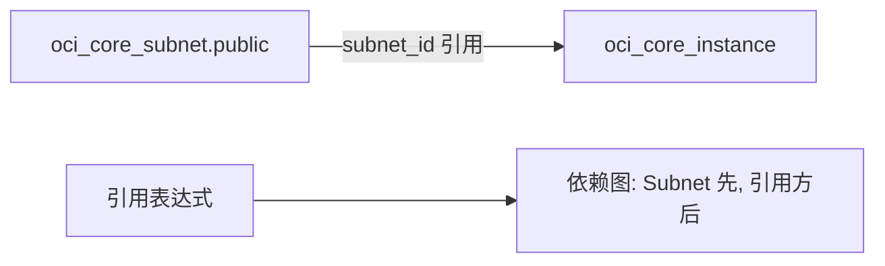

# 依赖图与引用表达式

OpenTofu 是怎么知道该先创建哪个资源、后创建哪个资源的？

## 核心要点

* 像 `subnet_id = oci_core_subnet.public.id` 这样的引用表达式，会让 OpenTofu 自动建立“Subnet 先创建、引用方后创建”的依赖图
* depends_on 只应该用在“值引用表达不出来的隐藏依赖”上，正常情况下并不需要手写
* 依赖图上互相独立的资源可以并行处理，这也是引用表达式比手写顺序更可靠的原因之一

---

## 本章测验

本章共 5 道单项选择题。

### 第 1 题

`subnet_id = oci_core_subnet.public.id` 这行代码的作用是什么？

- A. 手动指定资源创建的先后顺序数字
- B. 声明一个新的变量类型
- C. 禁止 OpenTofu 并行处理这两个资源
- D. 引用 Subnet 的创建结果，同时让 OpenTofu 自动建立依赖关系

选择答案后查看结果

正确答案：D

答案解析：这是一个典型的引用表达式，OpenTofu 会从这个表达式自动推导出“Subnet 必须先于引用它的资源被创建”。

### 第 2 题

depends_on 应该在什么情况下使用？

- A. 只在值引用表达不出来的隐藏依赖场景下使用
- B. 在每一个资源之间都手动添加，确保万无一失
- C. 代替所有的引用表达式来控制顺序
- D. 只用于删除资源，不用于创建资源

选择答案后查看结果

正确答案：A

答案解析：文档明确说明 depends_on 只用于值引用表达不出来的隐藏依赖，通常情况下并不需要，因为引用表达式已经足够。

### 第 3 题

依赖图中，互相没有引用关系的资源会怎样被处理？

- A. 必须严格按照代码书写顺序依次串行处理
- B. 可以被并行处理，因为它们之间没有先后依赖
- C. 会被自动合并成一个资源
- D. 会导致 apply 直接报错

选择答案后查看结果

正确答案：B

答案解析：文档中提到 Root 模块 apply 内部机制部分指出，图上独立的资源会被并行处理，这也是依赖图设计带来的效率优势。

### 第 4 题

如果两个资源之间存在真实依赖，但代码里既没有引用表达式也没有写 depends_on，会发生什么？

- A. OpenTofu 会自动扫描资源类型并智能猜测顺序
- B. OCI 会在 API 层面自动排队等待
- C. OpenTofu 无法感知这种依赖，可能出现创建顺序错误或依赖资源缺失的问题
- D. 这种情况在 OpenTofu 中不可能发生

选择答案后查看结果

正确答案：C

答案解析：依赖图是靠引用表达式或显式 depends_on 建立的，如果两者都没有，OpenTofu 就无法感知这层依赖，容易导致顺序问题。

### 第 5 题

为什么说“过度使用 depends_on”不是一个好习惯？

- A. 因为 depends_on 这个语法在 OpenTofu 1.8 之后已经被彻底移除
- B. 因为它会导致 State 文件体积成倍增大
- C. 因为它只能用在 Provider 配置块中
- D. 因为大多数依赖关系已经可以通过值引用自然表达，多余的 depends_on 只会增加维护负担

选择答案后查看结果

正确答案：D

答案解析：文档强调 depends_on 是用来补充“值引用表达不出来的隐藏依赖”，如果本来可以用引用表达式表达却手写 depends_on，属于不必要的额外负担。

<!-- QUIZ_DATA_START
{
  "chapter": "04",
  "questions": [
    {
      "id": 1,
      "question": "`subnet_id = oci_core_subnet.public.id` 这行代码的作用是什么？",
      "options": {
        "A": "手动指定资源创建的先后顺序数字",
        "B": "声明一个新的变量类型",
        "C": "禁止 OpenTofu 并行处理这两个资源",
        "D": "引用 Subnet 的创建结果，同时让 OpenTofu 自动建立依赖关系"
      },
      "answer": "D",
      "explanation": "这是一个典型的引用表达式，OpenTofu 会从这个表达式自动推导出“Subnet 必须先于引用它的资源被创建”。"
    },
    {
      "id": 2,
      "question": "depends_on 应该在什么情况下使用？",
      "options": {
        "A": "只在值引用表达不出来的隐藏依赖场景下使用",
        "B": "在每一个资源之间都手动添加，确保万无一失",
        "C": "代替所有的引用表达式来控制顺序",
        "D": "只用于删除资源，不用于创建资源"
      },
      "answer": "A",
      "explanation": "文档明确说明 depends_on 只用于值引用表达不出来的隐藏依赖，通常情况下并不需要，因为引用表达式已经足够。"
    },
    {
      "id": 3,
      "question": "依赖图中，互相没有引用关系的资源会怎样被处理？",
      "options": {
        "A": "必须严格按照代码书写顺序依次串行处理",
        "B": "可以被并行处理，因为它们之间没有先后依赖",
        "C": "会被自动合并成一个资源",
        "D": "会导致 apply 直接报错"
      },
      "answer": "B",
      "explanation": "文档中提到 Root 模块 apply 内部机制部分指出，图上独立的资源会被并行处理，这也是依赖图设计带来的效率优势。"
    },
    {
      "id": 4,
      "question": "如果两个资源之间存在真实依赖，但代码里既没有引用表达式也没有写 depends_on，会发生什么？",
      "options": {
        "A": "OpenTofu 会自动扫描资源类型并智能猜测顺序",
        "B": "OCI 会在 API 层面自动排队等待",
        "C": "OpenTofu 无法感知这种依赖，可能出现创建顺序错误或依赖资源缺失的问题",
        "D": "这种情况在 OpenTofu 中不可能发生"
      },
      "answer": "C",
      "explanation": "依赖图是靠引用表达式或显式 depends_on 建立的，如果两者都没有，OpenTofu 就无法感知这层依赖，容易导致顺序问题。"
    },
    {
      "id": 5,
      "question": "为什么说“过度使用 depends_on”不是一个好习惯？",
      "options": {
        "A": "因为 depends_on 这个语法在 OpenTofu 1.8 之后已经被彻底移除",
        "B": "因为它会导致 State 文件体积成倍增大",
        "C": "因为它只能用在 Provider 配置块中",
        "D": "因为大多数依赖关系已经可以通过值引用自然表达，多余的 depends_on 只会增加维护负担"
      },
      "answer": "D",
      "explanation": "文档强调 depends_on 是用来补充“值引用表达不出来的隐藏依赖”，如果本来可以用引用表达式表达却手写 depends_on，属于不必要的额外负担。"
    }
  ]
}
QUIZ_DATA_END -->
