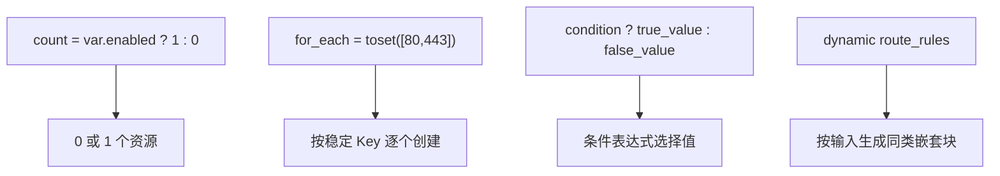

# 条件与循环语法

怎么用一份代码，灵活地控制资源要不要创建、创建几份？

## 核心要点

* `count = var.enabled ? 1 : 0` 可以用条件控制资源是否创建，实现“开关”效果
* `for_each = toset([...])` 会按照稳定的 Key 逐个创建资源，比如给 80 端口和 443 端口分别建规则
* `condition ? true_value : false_value` 是条件表达式，`dynamic` 块用于按输入批量生成同类型的嵌套配置块

---

## 本章测验

本章共 5 道单项选择题。

### 第 1 题

`count = var.enabled ? 1 : 0` 这行代码实现的是什么效果？

- A. 根据变量值决定资源是创建 1 份还是 0 份，相当于一个开关
- B. 强制资源永远创建两份用于冗余
- C. 禁止该资源被删除
- D. 把资源数量与其它模块的资源数量自动同步

选择答案后查看结果

正确答案：A

答案解析：这是条件表达式和 count 结合的典型写法，true 时创建 1 份，false 时创建 0 份，从而实现资源的启用/禁用开关。

### 第 2 题

`for_each = toset(["80", "443"])` 主要用来解决什么问题？

- A. 把两个端口合并成一个资源统一处理
- B. 按照稳定的 Key，为集合中的每个元素分别创建一份资源
- C. 随机生成端口号用于测试
- D. 禁止同时开放 80 和 443 两个端口

选择答案后查看结果

正确答案：B

答案解析：for_each 遍历集合中的每一个元素，为每个稳定的 Key（如端口号）分别创建对应的规则或资源。

### 第 3 题

条件表达式 `condition ? true_value : false_value` 的作用是什么？

- A. 定义一个新的资源类型
- B. 把两个值合并成一个字符串
- C. 根据条件的真假，选择两个值中的一个
- D. 只能用于布尔类型的变量声明

选择答案后查看结果

正确答案：C

答案解析：这是标准的条件表达式语法，用于在配置中根据条件动态选择赋值内容。

### 第 4 题

`dynamic "route_rules"` 这种写法的典型用途是什么？

- A. 强制关闭所有路由规则
- B. 把静态配置转换成只读的 Data Source
- C. 只能用于顶层 resource，不能用于嵌套块
- D. 根据输入数据，批量生成多个结构相同的嵌套配置块

选择答案后查看结果

正确答案：D

答案解析：dynamic 块专门用于根据输入（比如一个列表）批量生成同种类型的嵌套块，例如根据可选的 Service Gateway 路由列表生成多条 route_rules。

### 第 5 题

如果一个 Optional 资源使用了 `count = var.enabled ? 1 : 0` 且当前 enabled 为 false，下列说法正确的是？

- A. 该资源在 State 中不会被创建，但 `.tf` 中的语法和 Schema 依然可以被 validate 检查
- B. `tofu validate` 会直接报错，因为资源数量为 0
- C. 该资源的所有代码会被 OpenTofu 自动删除
- D. 这种写法在 OpenTofu 中并不被支持

选择答案后查看结果

正确答案：A

答案解析：`count = 0` 时资源不会被创建，但语法和 Provider Schema 依然会在 validate 阶段被检查，这也是后续章节会提到的“为什么 Optional 资源也能 validate”。

<!-- QUIZ_DATA_START
{
  "chapter": "05",
  "questions": [
    {
      "id": 1,
      "question": "`count = var.enabled ? 1 : 0` 这行代码实现的是什么效果？",
      "options": {
        "A": "根据变量值决定资源是创建 1 份还是 0 份，相当于一个开关",
        "B": "强制资源永远创建两份用于冗余",
        "C": "禁止该资源被删除",
        "D": "把资源数量与其它模块的资源数量自动同步"
      },
      "answer": "A",
      "explanation": "这是条件表达式和 count 结合的典型写法，true 时创建 1 份，false 时创建 0 份，从而实现资源的启用/禁用开关。"
    },
    {
      "id": 2,
      "question": "`for_each = toset([\"80\", \"443\"])` 主要用来解决什么问题？",
      "options": {
        "A": "把两个端口合并成一个资源统一处理",
        "B": "按照稳定的 Key，为集合中的每个元素分别创建一份资源",
        "C": "随机生成端口号用于测试",
        "D": "禁止同时开放 80 和 443 两个端口"
      },
      "answer": "B",
      "explanation": "for_each 遍历集合中的每一个元素，为每个稳定的 Key（如端口号）分别创建对应的规则或资源。"
    },
    {
      "id": 3,
      "question": "条件表达式 `condition ? true_value : false_value` 的作用是什么？",
      "options": {
        "A": "定义一个新的资源类型",
        "B": "把两个值合并成一个字符串",
        "C": "根据条件的真假，选择两个值中的一个",
        "D": "只能用于布尔类型的变量声明"
      },
      "answer": "C",
      "explanation": "这是标准的条件表达式语法，用于在配置中根据条件动态选择赋值内容。"
    },
    {
      "id": 4,
      "question": "`dynamic \"route_rules\"` 这种写法的典型用途是什么？",
      "options": {
        "A": "强制关闭所有路由规则",
        "B": "把静态配置转换成只读的 Data Source",
        "C": "只能用于顶层 resource，不能用于嵌套块",
        "D": "根据输入数据，批量生成多个结构相同的嵌套配置块"
      },
      "answer": "D",
      "explanation": "dynamic 块专门用于根据输入（比如一个列表）批量生成同种类型的嵌套块，例如根据可选的 Service Gateway 路由列表生成多条 route_rules。"
    },
    {
      "id": 5,
      "question": "如果一个 Optional 资源使用了 `count = var.enabled ? 1 : 0` 且当前 enabled 为 false，下列说法正确的是？",
      "options": {
        "A": "该资源在 State 中不会被创建，但 `.tf` 中的语法和 Schema 依然可以被 validate 检查",
        "B": "`tofu validate` 会直接报错，因为资源数量为 0",
        "C": "该资源的所有代码会被 OpenTofu 自动删除",
        "D": "这种写法在 OpenTofu 中并不被支持"
      },
      "answer": "A",
      "explanation": "`count = 0` 时资源不会被创建，但语法和 Provider Schema 依然会在 validate 阶段被检查，这也是后续章节会提到的“为什么 Optional 资源也能 validate”。"
    }
  ]
}
QUIZ_DATA_END -->
