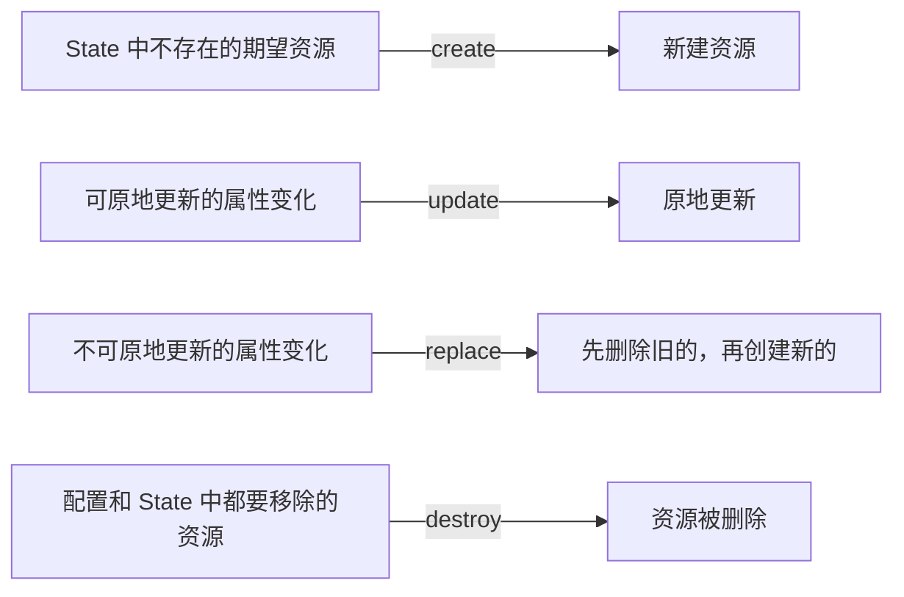

# Lifecycle 与 Plan 符号

create、update、replace、destroy 到底有什么区别，plan 里的符号又代表什么？

## 核心要点

* create 针对 State 中不存在的期望资源；update 针对可原地更新的属性变化
* 更新不可原地变更的属性时会触发 replace：先删除旧资源，再创建新资源
* plan 符号：`+` 表示创建，`~` 表示原地更新，`-/+` 表示先删后建，`-` 表示删除

---

## 本章测验

本章共 5 道单项选择题。

### 第 1 题

`update` 生命周期动作对应的场景是什么？

- A. 资源在 State 中完全不存在
- B. 属性发生变化，且该属性可以原地更新
- C. 资源需要被彻底删除且不再需要
- D. 属性变化但该属性不支持原地更新

选择答案后查看结果

正确答案：B

答案解析：update 是针对“可以原地更新的属性”变化，如果属性不支持原地更新，则会触发 replace 而不是 update。

### 第 2 题

`replace` 动作实际发生的过程是什么？

- A. 只修改资源的显示名称而不动其它属性
- B. 把资源转移到另一个 Compartment 而不删除
- C. 先删除旧资源，再创建一个新资源
- D. 跳过删除步骤直接原地覆盖

选择答案后查看结果

正确答案：C

答案解析：replace 是当更新的属性不支持原地变更时触发的，实际操作是先删除旧资源，再新建一个资源来满足新的期望状态。

### 第 3 题

plan 输出中的 `-/+` 符号代表什么含义？

- A. 原地更新，不会删除资源
- B. 仅创建，不涉及删除
- C. 仅删除，不会再创建新的
- D. 先删除该资源，再重新创建一份新的

选择答案后查看结果

正确答案：D

答案解析：`-/+` 正是 replace 生命周期动作在 plan 中的可视化表示：先删除，再创建。

### 第 4 题

plan 输出中只看到一个 `~` 符号，说明接下来会发生什么？

- A. 该资源会被原地更新，不会被删除重建
- B. 该资源即将被彻底删除
- C. 该资源是全新创建的
- D. 该资源没有任何变化

选择答案后查看结果

正确答案：A

答案解析：`~` 专门表示原地更新（update），区别于表示删除重建的 `-/+`。

### 第 5 题

为什么在 apply 前认真阅读 plan 里的符号很重要？

- A. 因为符号会决定这次 apply 使用的 Provider 版本
- B. 因为 `-/+` 意味着资源会被删除重建，可能导致数据丢失或短暂中断，而 `~` 通常影响较小
- C. 因为符号只是装饰性的，不影响实际执行结果
- D. 因为符号只在 destroy 命令中出现，plan 阶段可以忽略

选择答案后查看结果

正确答案：B

答案解析：区分 `~`（原地更新，通常影响小）和 `-/+`（删除重建，可能造成数据丢失或服务中断）能帮助工程师在 apply 前判断变更的真实风险。

<!-- QUIZ_DATA_START
{
  "chapter": "06",
  "questions": [
    {
      "id": 1,
      "question": "`update` 生命周期动作对应的场景是什么？",
      "options": {
        "A": "资源在 State 中完全不存在",
        "B": "属性发生变化，且该属性可以原地更新",
        "C": "资源需要被彻底删除且不再需要",
        "D": "属性变化但该属性不支持原地更新"
      },
      "answer": "B",
      "explanation": "update 是针对“可以原地更新的属性”变化，如果属性不支持原地更新，则会触发 replace 而不是 update。"
    },
    {
      "id": 2,
      "question": "`replace` 动作实际发生的过程是什么？",
      "options": {
        "A": "只修改资源的显示名称而不动其它属性",
        "B": "把资源转移到另一个 Compartment 而不删除",
        "C": "先删除旧资源，再创建一个新资源",
        "D": "跳过删除步骤直接原地覆盖"
      },
      "answer": "C",
      "explanation": "replace 是当更新的属性不支持原地变更时触发的，实际操作是先删除旧资源，再新建一个资源来满足新的期望状态。"
    },
    {
      "id": 3,
      "question": "plan 输出中的 `-/+` 符号代表什么含义？",
      "options": {
        "A": "原地更新，不会删除资源",
        "B": "仅创建，不涉及删除",
        "C": "仅删除，不会再创建新的",
        "D": "先删除该资源，再重新创建一份新的"
      },
      "answer": "D",
      "explanation": "`-/+` 正是 replace 生命周期动作在 plan 中的可视化表示：先删除，再创建。"
    },
    {
      "id": 4,
      "question": "plan 输出中只看到一个 `~` 符号，说明接下来会发生什么？",
      "options": {
        "A": "该资源会被原地更新，不会被删除重建",
        "B": "该资源即将被彻底删除",
        "C": "该资源是全新创建的",
        "D": "该资源没有任何变化"
      },
      "answer": "A",
      "explanation": "`~` 专门表示原地更新（update），区别于表示删除重建的 `-/+`。"
    },
    {
      "id": 5,
      "question": "为什么在 apply 前认真阅读 plan 里的符号很重要？",
      "options": {
        "A": "因为符号会决定这次 apply 使用的 Provider 版本",
        "B": "因为 `-/+` 意味着资源会被删除重建，可能导致数据丢失或短暂中断，而 `~` 通常影响较小",
        "C": "因为符号只是装饰性的，不影响实际执行结果",
        "D": "因为符号只在 destroy 命令中出现，plan 阶段可以忽略"
      },
      "answer": "B",
      "explanation": "区分 `~`（原地更新，通常影响小）和 `-/+`（删除重建，可能造成数据丢失或服务中断）能帮助工程师在 apply 前判断变更的真实风险。"
    }
  ]
}
QUIZ_DATA_END -->
