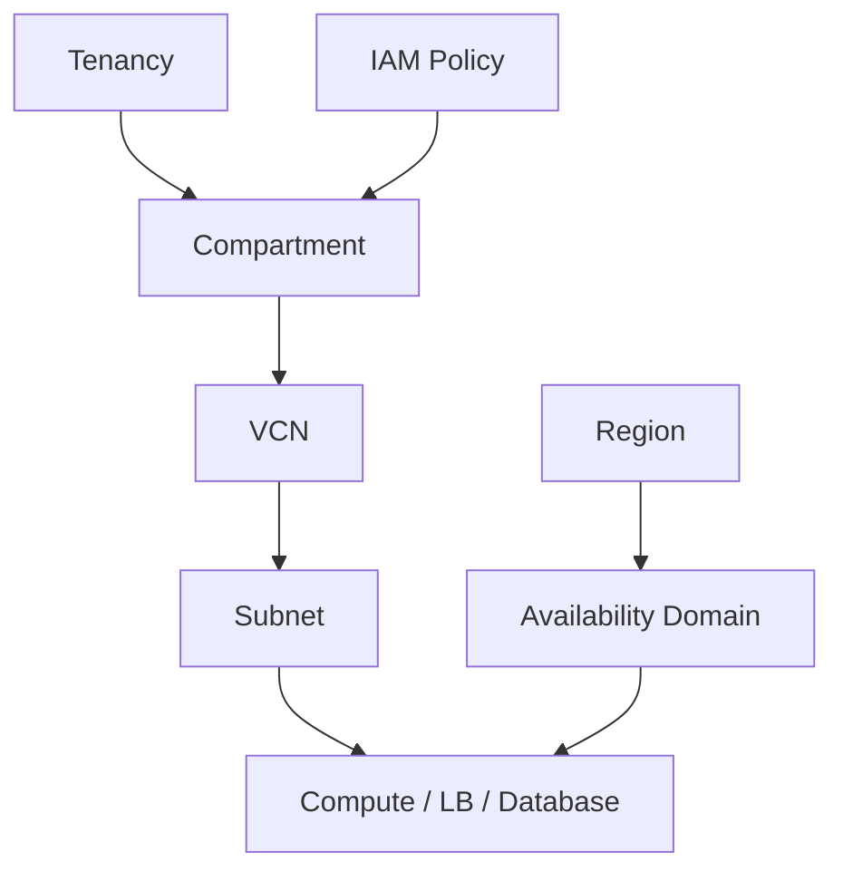

# OCI 基础概念

Tenancy、Region、Compartment、可用区之间是什么关系？

## 核心要点

* Tenancy 是最上层的边界，内部通过 Compartment 来组织和隔离资源
* Region 是地理位置单位，Availability Domain（可用区）是 Region 内部的故障隔离单位
* 服务的可用性、配额、免费额度、容量都会因 Region 和 Account 的不同而不同

---

## 本章测验

本章共 5 道单项选择题。

### 第 1 题

Tenancy 在 OCI 结构中扮演的角色是什么？

- A. 一种用来分割网络流量的路由表
- B. 一个仅用于存储对象的存储桶
- C. 最上层的边界，其内部通过 Compartment 组织资源
- D. 一种可以随意创建、彼此完全独立、互不相干的临时容器

选择答案后查看结果

正确答案：C

答案解析：文档明确说明 OCI 以 Tenancy 为最上层边界，在其内部用 Compartment 来做组织和管理。

### 第 2 题

Region 和 Availability Domain 之间的关系是什么？

- A. Availability Domain 是比 Region 更大的地理范围
- B. 两者是完全相同的概念，只是名字不同
- C. Availability Domain 只存在于 Compartment 内部，与 Region 无关
- D. Region 是地理位置单位，Availability Domain 是 Region 内部的故障隔离单位

选择答案后查看结果

正确答案：D

答案解析：文档描述 Region 是地理配置单位，Availability Domain 是 Region 内的故障隔离单位，二者是包含关系，不是同级或相反关系。

### 第 3 题

为什么“服务在某个 Region 可用”不代表“配额一定充足”？

- A. 因为服务的可用性、配额、免费额度、容量都会因 Region 和账户而异
- B. 因为配额只取决于代码写得是否正确
- C. 因为 OCI 的配额在全球所有 Region 都完全一致
- D. 因为免费额度与 Region 无关，只与创建时间有关

选择答案后查看结果

正确答案：A

答案解析：文档提醒服务提供状况、Quota、Free Tier、Capacity 都会随 Region 和 Account 的不同而变化，即使服务在该地区可用，也不代表配额或容量一定够用。

### 第 4 题

OCID 这个标识符的敏感性体现在哪里？

- A. OCID 本质上就是账户密码，绝对不能出现在任何地方
- B. 虽然不一定是机密值本身，但会暴露环境结构，因此不建议把真实值写入公开仓库
- C. OCID 只是一个纯粹的显示名称，没有任何风险
- D. OCID 会在每次 apply 后自动随机更换

选择答案后查看结果

正确答案：B

答案解析：文档指出 OCID 虽然不一定是敏感值本身，但由于会暴露环境结构信息，所以不建议把真实 OCID 写入公开仓库。

### 第 5 题

下列哪一组对应关系最准确地反映了 Tenancy → Compartment → VCN → Subnet → Resource 的层级？

- A. 从具体资源开始，逐层向外扩展到账户边界
- B. 四者是并列关系，没有先后包含顺序
- C. 从账户边界，到管理组织单位，到网络边界，到子网划分，最后到具体资源
- D. Subnet 是最外层，Tenancy 是最内层

选择答案后查看结果

正确答案：C

答案解析：结构图显示的是从上到下的包含关系：Tenancy 包含 Compartment，Compartment 内创建 VCN，VCN 划分出 Subnet，Subnet 中承载具体资源。

<!-- QUIZ_DATA_START
{
  "chapter": "07",
  "questions": [
    {
      "id": 1,
      "question": "Tenancy 在 OCI 结构中扮演的角色是什么？",
      "options": {
        "A": "一种用来分割网络流量的路由表",
        "B": "一个仅用于存储对象的存储桶",
        "C": "最上层的边界，其内部通过 Compartment 组织资源",
        "D": "一种可以随意创建、彼此完全独立、互不相干的临时容器"
      },
      "answer": "C",
      "explanation": "文档明确说明 OCI 以 Tenancy 为最上层边界，在其内部用 Compartment 来做组织和管理。"
    },
    {
      "id": 2,
      "question": "Region 和 Availability Domain 之间的关系是什么？",
      "options": {
        "A": "Availability Domain 是比 Region 更大的地理范围",
        "B": "两者是完全相同的概念，只是名字不同",
        "C": "Availability Domain 只存在于 Compartment 内部，与 Region 无关",
        "D": "Region 是地理位置单位，Availability Domain 是 Region 内部的故障隔离单位"
      },
      "answer": "D",
      "explanation": "文档描述 Region 是地理配置单位，Availability Domain 是 Region 内的故障隔离单位，二者是包含关系，不是同级或相反关系。"
    },
    {
      "id": 3,
      "question": "为什么“服务在某个 Region 可用”不代表“配额一定充足”？",
      "options": {
        "A": "因为服务的可用性、配额、免费额度、容量都会因 Region 和账户而异",
        "B": "因为配额只取决于代码写得是否正确",
        "C": "因为 OCI 的配额在全球所有 Region 都完全一致",
        "D": "因为免费额度与 Region 无关，只与创建时间有关"
      },
      "answer": "A",
      "explanation": "文档提醒服务提供状况、Quota、Free Tier、Capacity 都会随 Region 和 Account 的不同而变化，即使服务在该地区可用，也不代表配额或容量一定够用。"
    },
    {
      "id": 4,
      "question": "OCID 这个标识符的敏感性体现在哪里？",
      "options": {
        "A": "OCID 本质上就是账户密码，绝对不能出现在任何地方",
        "B": "虽然不一定是机密值本身，但会暴露环境结构，因此不建议把真实值写入公开仓库",
        "C": "OCID 只是一个纯粹的显示名称，没有任何风险",
        "D": "OCID 会在每次 apply 后自动随机更换"
      },
      "answer": "B",
      "explanation": "文档指出 OCID 虽然不一定是敏感值本身，但由于会暴露环境结构信息，所以不建议把真实 OCID 写入公开仓库。"
    },
    {
      "id": 5,
      "question": "下列哪一组对应关系最准确地反映了 Tenancy → Compartment → VCN → Subnet → Resource 的层级？",
      "options": {
        "A": "从具体资源开始，逐层向外扩展到账户边界",
        "B": "四者是并列关系，没有先后包含顺序",
        "C": "从账户边界，到管理组织单位，到网络边界，到子网划分，最后到具体资源",
        "D": "Subnet 是最外层，Tenancy 是最内层"
      },
      "answer": "C",
      "explanation": "结构图显示的是从上到下的包含关系：Tenancy 包含 Compartment，Compartment 内创建 VCN，VCN 划分出 Subnet，Subnet 中承载具体资源。"
    }
  ]
}
QUIZ_DATA_END -->
