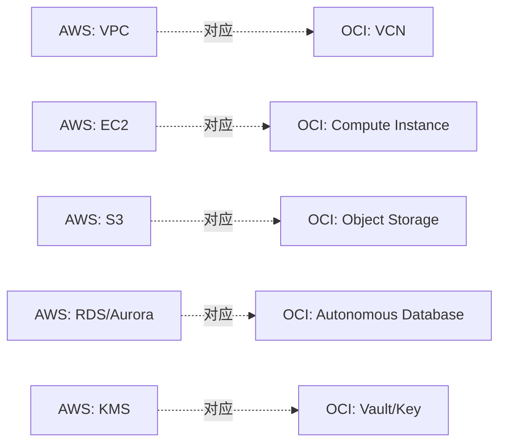

# OCI 与 AWS / Azure 概念对照

有 AWS 经验的人，怎么快速把已有知识映射到 OCI？

## 核心要点

* VCN 对应 AWS 的 VPC 和 Azure 的 VNet，Compute Instance 对应 EC2 和 Virtual Machines
* Object Storage 对应 S3 和 Blob Storage，Autonomous Database 与 RDS/Aurora、Azure SQL 目的类似但不是同一 Engine
* 这只是概念上的对应，功能、价格、限制、一致性模型、IAM 模型并不完全相同，不能照搬配置直接套用

---

## 本章测验

本章共 5 道单项选择题。

### 第 1 题

OCI 的 VCN 大致对应 AWS 和 Azure 的哪个概念？

- A. AWS 的 EC2 和 Azure 的 Virtual Machines
- B. AWS 的 S3 和 Azure 的 Blob Storage
- C. AWS 的 IAM 和 Azure 的 Active Directory
- D. AWS 的 VPC 和 Azure 的 VNet

选择答案后查看结果

正确答案：D

答案解析：对照表中明确列出 VCN 对应 AWS VPC 和 Azure VNet，都是虚拟网络边界的概念。

### 第 2 题

Autonomous Database 与 AWS RDS/Aurora 的关系应该如何理解？

- A. 目的类似，但 Engine 和运维模式并不完全相同
- B. 它们是完全相同的产品，只是换了名字
- C. Autonomous Database 是 RDS 的一个内部组件
- D. 两者没有任何可比性，完全不同类别的产品

选择答案后查看结果

正确答案：A

答案解析：文档特别强调“目的类似，但 Engine 与运维模型不是同一件事”，避免学习者把两者当成可以直接迁移替换的等价物。

### 第 3 题

为什么这份对照表不能被当作“配置可以直接照搬”的依据？

- A. 因为对照表本身列出的名字是错误的
- B. 因为功能、价格、限制、一致性模型、IAM 模型并不完全相同
- C. 因为 OCI 根本没有与 AWS 类似的任何服务
- D. 因为对照只适用于中国区域，其它区域不适用

选择答案后查看结果

正确答案：B

答案解析：文档明确指出这是“概念上的对应”，并非意味着功能、价格、限制、一致性、IAM 模型完全相同，所以不能直接照搬配置。

### 第 4 题

Container Registry 在这份对照表中对应的是什么？

- A. AWS 的 Lambda 和 Azure 的 Functions
- B. AWS 的 Route 53 和 Azure 的 DNS
- C. AWS 的 ECR 和 Azure 的 Container Registry
- D. AWS 的 CloudWatch 和 Azure Monitor

选择答案后查看结果

正确答案：C

答案解析：对照表把 Container Registry 与 AWS ECR、Azure Container Registry 对应，都是容器镜像仓库服务。

### 第 5 题

对于一位有 AWS 背景的学习者，这份对照表最大的价值是什么？

- A. 可以完全跳过 OCI 文档，只看 AWS 文档就足够了
- B. 意味着 AWS 的 IAM 策略可以直接复制到 OCI 使用
- C. 意味着两个云的价格计算方式完全一致
- D. 帮助快速建立概念映射，加速理解，但仍需单独确认 OCI 具体行为差异

选择答案后查看结果

正确答案：D

答案解析：对照表的作用是加速概念理解，但文档特别强调这不代表功能、价格、IAM 模型相同，具体行为仍需单独确认。

<!-- QUIZ_DATA_START
{
  "chapter": "08",
  "questions": [
    {
      "id": 1,
      "question": "OCI 的 VCN 大致对应 AWS 和 Azure 的哪个概念？",
      "options": {
        "A": "AWS 的 EC2 和 Azure 的 Virtual Machines",
        "B": "AWS 的 S3 和 Azure 的 Blob Storage",
        "C": "AWS 的 IAM 和 Azure 的 Active Directory",
        "D": "AWS 的 VPC 和 Azure 的 VNet"
      },
      "answer": "D",
      "explanation": "对照表中明确列出 VCN 对应 AWS VPC 和 Azure VNet，都是虚拟网络边界的概念。"
    },
    {
      "id": 2,
      "question": "Autonomous Database 与 AWS RDS/Aurora 的关系应该如何理解？",
      "options": {
        "A": "目的类似，但 Engine 和运维模式并不完全相同",
        "B": "它们是完全相同的产品，只是换了名字",
        "C": "Autonomous Database 是 RDS 的一个内部组件",
        "D": "两者没有任何可比性，完全不同类别的产品"
      },
      "answer": "A",
      "explanation": "文档特别强调“目的类似，但 Engine 与运维模型不是同一件事”，避免学习者把两者当成可以直接迁移替换的等价物。"
    },
    {
      "id": 3,
      "question": "为什么这份对照表不能被当作“配置可以直接照搬”的依据？",
      "options": {
        "A": "因为对照表本身列出的名字是错误的",
        "B": "因为功能、价格、限制、一致性模型、IAM 模型并不完全相同",
        "C": "因为 OCI 根本没有与 AWS 类似的任何服务",
        "D": "因为对照只适用于中国区域，其它区域不适用"
      },
      "answer": "B",
      "explanation": "文档明确指出这是“概念上的对应”，并非意味着功能、价格、限制、一致性、IAM 模型完全相同，所以不能直接照搬配置。"
    },
    {
      "id": 4,
      "question": "Container Registry 在这份对照表中对应的是什么？",
      "options": {
        "A": "AWS 的 Lambda 和 Azure 的 Functions",
        "B": "AWS 的 Route 53 和 Azure 的 DNS",
        "C": "AWS 的 ECR 和 Azure 的 Container Registry",
        "D": "AWS 的 CloudWatch 和 Azure Monitor"
      },
      "answer": "C",
      "explanation": "对照表把 Container Registry 与 AWS ECR、Azure Container Registry 对应，都是容器镜像仓库服务。"
    },
    {
      "id": 5,
      "question": "对于一位有 AWS 背景的学习者，这份对照表最大的价值是什么？",
      "options": {
        "A": "可以完全跳过 OCI 文档，只看 AWS 文档就足够了",
        "B": "意味着 AWS 的 IAM 策略可以直接复制到 OCI 使用",
        "C": "意味着两个云的价格计算方式完全一致",
        "D": "帮助快速建立概念映射，加速理解，但仍需单独确认 OCI 具体行为差异"
      },
      "answer": "D",
      "explanation": "对照表的作用是加速概念理解，但文档特别强调这不代表功能、价格、IAM 模型相同，具体行为仍需单独确认。"
    }
  ]
}
QUIZ_DATA_END -->
