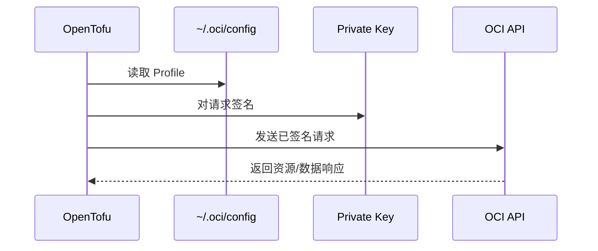

# Provider 认证与密钥安全

OpenTofu 是怎么以你的身份安全地调用 OCI API 的？

## 核心要点

* Provider 用私钥对请求签名，OCI 用注册在 User 上的公钥和指纹来验证身份，需要 tenancy_ocid、user_ocid、fingerprint、private_key_path、region 五个值
* 私钥绝不能上传到 GitHub；`terraform.tfvars` 和 State 也可能包含敏感值，都应排除在版本控制之外
* CI 环境中不要把密钥文件直接存进仓库，应考虑短期凭证、Vault/Secret Store、受保护的 CI Secret

---

## 本章测验

本章共 5 道单项选择题。

### 第 1 题

Provider 认证的基本原理是什么？

- A. 用私钥对请求签名，OCI 用注册的公钥和指纹验证身份
- B. 直接把明文密码放在 URL 参数里传输
- C. 完全依赖 IP 白名单，不需要任何密钥
- D. 使用一次性短信验证码进行身份验证

选择答案后查看结果

正确答案：A

答案解析：文档描述认证方式是 Provider 用私钥签名请求，OCI 侧用注册在 User 上的公钥和指纹进行验证，这是 API Signing Key 机制的核心。

### 第 2 题

配置 Provider 认证时，以下哪一组是必须提供的值？

- A. 只需要用户名和明文密码两项即可
- B. tenancy_ocid、user_ocid、fingerprint、private_key_path、region
- C. 只需要一个 API Token，不需要其它任何信息
- D. 只需要 Region 名称，其余会自动检测

选择答案后查看结果

正确答案：B

答案解析：文档列出的必需值正是 tenancy_ocid、user_ocid、fingerprint、private_key_path、region 这五项。

### 第 3 题

为什么私钥绝对不能上传到 GitHub？

- A. 因为 GitHub 会自动收取存储私钥的额外费用
- B. 因为私钥文件格式与 GitHub 不兼容，会导致仓库损坏
- C. 泄露后第三方就能以本人身份调用 OCI API
- D. 因为上传私钥会让仓库自动变为私有

选择答案后查看结果

正确答案：C

答案解析：文档明确警告私钥一旦泄露，第三方可以冒充本人调用 OCI API，这是最严重的安全风险之一。

### 第 4 题

如果私钥意外泄露，文档建议的紧急处理步骤中不包括以下哪一项？

- A. 立即从 User 上删除对应的公钥
- B. 重新生成新的密钥对
- C. 检查 Audit Log
- D. 立即把整个 Tenancy 删除重建

选择答案后查看结果

正确答案：D

答案解析：文档建议的紧急处理是立即删除泄露的公钥、重新生成 Key、检查审计日志，并没有提到需要删除整个 Tenancy 这种极端做法。

### 第 5 题

在 CI 环境中管理密钥，文档推荐的做法是什么？

- A. 考虑短期凭证、Vault/Secret Store、受保护的 CI Secret，不把密钥文件直接存入仓库
- B. 把私钥直接硬编码进 CI 脚本文件并提交到仓库
- C. 在每次 CI 运行日志中打印完整私钥内容以便排查
- D. 关闭所有认证机制以简化 CI 流程

选择答案后查看结果

正确答案：A

答案解析：文档明确指出 CI 环境不应在仓库中保存密钥文件，而应使用短期凭证、Vault/Secret Store 或受保护的 CI Secret，并且要注意环境变量也可能泄露到日志中。

<!-- QUIZ_DATA_START
{
  "chapter": "09",
  "questions": [
    {
      "id": 1,
      "question": "Provider 认证的基本原理是什么？",
      "options": {
        "A": "用私钥对请求签名，OCI 用注册的公钥和指纹验证身份",
        "B": "直接把明文密码放在 URL 参数里传输",
        "C": "完全依赖 IP 白名单，不需要任何密钥",
        "D": "使用一次性短信验证码进行身份验证"
      },
      "answer": "A",
      "explanation": "文档描述认证方式是 Provider 用私钥签名请求，OCI 侧用注册在 User 上的公钥和指纹进行验证，这是 API Signing Key 机制的核心。"
    },
    {
      "id": 2,
      "question": "配置 Provider 认证时，以下哪一组是必须提供的值？",
      "options": {
        "A": "只需要用户名和明文密码两项即可",
        "B": "tenancy_ocid、user_ocid、fingerprint、private_key_path、region",
        "C": "只需要一个 API Token，不需要其它任何信息",
        "D": "只需要 Region 名称，其余会自动检测"
      },
      "answer": "B",
      "explanation": "文档列出的必需值正是 tenancy_ocid、user_ocid、fingerprint、private_key_path、region 这五项。"
    },
    {
      "id": 3,
      "question": "为什么私钥绝对不能上传到 GitHub？",
      "options": {
        "A": "因为 GitHub 会自动收取存储私钥的额外费用",
        "B": "因为私钥文件格式与 GitHub 不兼容，会导致仓库损坏",
        "C": "泄露后第三方就能以本人身份调用 OCI API",
        "D": "因为上传私钥会让仓库自动变为私有"
      },
      "answer": "C",
      "explanation": "文档明确警告私钥一旦泄露，第三方可以冒充本人调用 OCI API，这是最严重的安全风险之一。"
    },
    {
      "id": 4,
      "question": "如果私钥意外泄露，文档建议的紧急处理步骤中不包括以下哪一项？",
      "options": {
        "A": "立即从 User 上删除对应的公钥",
        "B": "重新生成新的密钥对",
        "C": "检查 Audit Log",
        "D": "立即把整个 Tenancy 删除重建"
      },
      "answer": "D",
      "explanation": "文档建议的紧急处理是立即删除泄露的公钥、重新生成 Key、检查审计日志，并没有提到需要删除整个 Tenancy 这种极端做法。"
    },
    {
      "id": 5,
      "question": "在 CI 环境中管理密钥，文档推荐的做法是什么？",
      "options": {
        "A": "考虑短期凭证、Vault/Secret Store、受保护的 CI Secret，不把密钥文件直接存入仓库",
        "B": "把私钥直接硬编码进 CI 脚本文件并提交到仓库",
        "C": "在每次 CI 运行日志中打印完整私钥内容以便排查",
        "D": "关闭所有认证机制以简化 CI 流程"
      },
      "answer": "A",
      "explanation": "文档明确指出 CI 环境不应在仓库中保存密钥文件，而应使用短期凭证、Vault/Secret Store 或受保护的 CI Secret，并且要注意环境变量也可能泄露到日志中。"
    }
  ]
}
QUIZ_DATA_END -->
