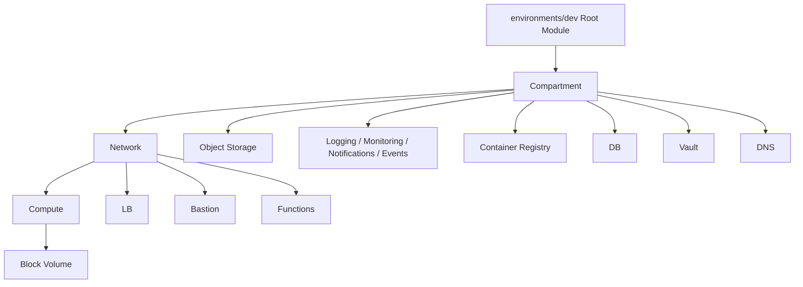

# 项目架构：Root Module 与 Child Module

这个项目的代码是怎么分层组织的？

## 核心要点

* `environments/dev` 是 Root Module，`modules/*` 下的各个目录是 Child Module
* Root Module 负责统一标签、Data Source 查询、功能开关，以及在各个模块之间传递 OCID
* 像 `subnet_id = module.network.public_subnet_id` 这样的写法，把 Network 的输出传给 Compute 的输入，这层值引用天然构成了依赖图，不需要手写 depends_on

---

## 本章测验

本章共 5 道单项选择题。

### 第 1 题

在这个项目中，Root Module 具体指的是哪个目录？

- A. modules 目录本身
- B. environments/dev
- C. docs 目录
- D. scripts 目录

选择答案后查看结果

正确答案：B

答案解析：文档明确说明 environments/dev 是 Root Module，负责统筹整个部署，而 modules/* 是 Child Module。

### 第 2 题

Root Module 承担的主要职责不包括以下哪一项？

- A. 统一管理公共标签
- B. 查询 Data Source 获取已有信息
- C. 直接在 Root Module 中重复实现每个具体资源的详细配置逻辑
- D. 在各模块之间传递 OCID

选择答案后查看结果

正确答案：C

答案解析：具体资源的详细配置逻辑是分散在各个 Child Module 中实现的，Root Module 的职责是统筹连接，而不是重复实现细节。

### 第 3 题

`subnet_id = module.network.public_subnet_id` 这行代码体现了什么设计思路？

- A. 强制两个模块合并成一个模块
- B. 手动指定两个模块的创建顺序编号
- C. 禁止 Compute 模块访问网络相关信息
- D. 把 Network 模块的输出值，作为 Compute 模块的输入值传递

选择答案后查看结果

正确答案：D

答案解析：这行代码通过值引用把 Network 模块的输出传递给 Compute 模块的输入，这正是模块间通信和依赖的典型方式。

### 第 4 题

为什么这种模块间的值引用可以替代手写 depends_on？

- A. 因为值引用本身就会让 OpenTofu 自动建立依赖图
- B. 因为 depends_on 语法在跨模块场景下会直接报错
- C. 因为跨模块引用永远是并行执行，不存在顺序问题
- D. 因为这只是巧合，与依赖图机制无关

选择答案后查看结果

正确答案：A

答案解析：正如前面依赖图章节所述，值引用表达式会自动让 OpenTofu 建立正确的创建顺序，所以这种场景通常不需要额外的 depends_on。

### 第 5 题

观察架构图可以发现，Compartment 是许多模块共同的上游节点，这说明了什么？

- A. Compartment 只是可选项，大多数模块可以完全绕开它
- B. 几乎所有资源都需要先确定所属的 Compartment，才能进一步创建
- C. Compartment 与 Network 模块没有任何关系
- D. 图中的箭头方向可以随意颠倒，不影响实际执行

选择答案后查看结果

正确答案：B

答案解析：架构图显示 Compartment 是 Network、Object Storage、Observability、Registry、Database、Vault、DNS 等多个模块共同的上游依赖，说明 Compartment 是几乎所有资源创建的前提。

<!-- QUIZ_DATA_START
{
  "chapter": "10",
  "questions": [
    {
      "id": 1,
      "question": "在这个项目中，Root Module 具体指的是哪个目录？",
      "options": {
        "A": "modules 目录本身",
        "B": "environments/dev",
        "C": "docs 目录",
        "D": "scripts 目录"
      },
      "answer": "B",
      "explanation": "文档明确说明 environments/dev 是 Root Module，负责统筹整个部署，而 modules/* 是 Child Module。"
    },
    {
      "id": 2,
      "question": "Root Module 承担的主要职责不包括以下哪一项？",
      "options": {
        "A": "统一管理公共标签",
        "B": "查询 Data Source 获取已有信息",
        "C": "直接在 Root Module 中重复实现每个具体资源的详细配置逻辑",
        "D": "在各模块之间传递 OCID"
      },
      "answer": "C",
      "explanation": "具体资源的详细配置逻辑是分散在各个 Child Module 中实现的，Root Module 的职责是统筹连接，而不是重复实现细节。"
    },
    {
      "id": 3,
      "question": "`subnet_id = module.network.public_subnet_id` 这行代码体现了什么设计思路？",
      "options": {
        "A": "强制两个模块合并成一个模块",
        "B": "手动指定两个模块的创建顺序编号",
        "C": "禁止 Compute 模块访问网络相关信息",
        "D": "把 Network 模块的输出值，作为 Compute 模块的输入值传递"
      },
      "answer": "D",
      "explanation": "这行代码通过值引用把 Network 模块的输出传递给 Compute 模块的输入，这正是模块间通信和依赖的典型方式。"
    },
    {
      "id": 4,
      "question": "为什么这种模块间的值引用可以替代手写 depends_on？",
      "options": {
        "A": "因为值引用本身就会让 OpenTofu 自动建立依赖图",
        "B": "因为 depends_on 语法在跨模块场景下会直接报错",
        "C": "因为跨模块引用永远是并行执行，不存在顺序问题",
        "D": "因为这只是巧合，与依赖图机制无关"
      },
      "answer": "A",
      "explanation": "正如前面依赖图章节所述，值引用表达式会自动让 OpenTofu 建立正确的创建顺序，所以这种场景通常不需要额外的 depends_on。"
    },
    {
      "id": 5,
      "question": "观察架构图可以发现，Compartment 是许多模块共同的上游节点，这说明了什么？",
      "options": {
        "A": "Compartment 只是可选项，大多数模块可以完全绕开它",
        "B": "几乎所有资源都需要先确定所属的 Compartment，才能进一步创建",
        "C": "Compartment 与 Network 模块没有任何关系",
        "D": "图中的箭头方向可以随意颠倒，不影响实际执行"
      },
      "answer": "B",
      "explanation": "架构图显示 Compartment 是 Network、Object Storage、Observability、Registry、Database、Vault、DNS 等多个模块共同的上游依赖，说明 Compartment 是几乎所有资源创建的前提。"
    }
  ]
}
QUIZ_DATA_END -->
